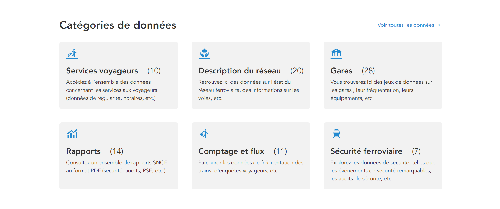

# Introduction

Ce projet a été réalisé dans le cadre du cours **Visualisation de données**, au cours du semestre de **printemps 2024**, à **l'Université de Technologie de Troyes**.

Pour cette étude, nous avons choisi d'analyser des données originales qui nous permettent de nous interroger sur **l'étude du transport ferroviaire en France**. Notre analyse portera sur des jeux de données extraits du site de données de la SNCF (Société Nationale des Chemins de fer Français) [Data SNCF](https://data.sncf.com). L'ensemble des données qui vont donc être traitées dans ce projet proviennent donc toutes de cette source. Nous n'avons donc pas utilisé de jeux de données extérieurs à ce site.

Les données récoltées sur le transport sont assez importantes c'est pourquoi nous avons choisi de nous concentrer sur une découverte avec un spectre assez large, allant des voyageurs aux objets perdus. Nous utiliserons les données des gares, des voyageurs et des objets perdus/retrouvés. Cette étude permettra de déterminer et de comprendre des tendances clés associées au trafic ferroviaire sur des périodes allant de 2017 à 2022.

L'objectif de ce projet est de fournir des interprétations basées sur les visualisations issues d'une analyse exploratoire de nos jeux de données (7 jeux de données).

## Données

Nous avons donc choisi d'étudier sept jeux de données (7) issues du site [Data SNCF](https://data.sncf.com). Ce sont des données collectées par la SNCF parmi les différentes catégories disponible sur le site (voir ci-dessous).



Ces données concernent des objets possedés par la SNCF (gares, objets) mais aussi des enquêtes réalisées sur des individus anonymement (fréquentation, voyageurs). Les données sont liées à une période temporelle précise de **2017 à 2022**.

> L'ensemble des données brutes sont accessibles depuis le dossier /data.

**Nombre d'observations**

Le nombre d'observations varie selon chaque jeu de données. Pour plus de détail, nous avons détaillé précisement le nombre d'observations dont nous disposions.

| --- | Nom du dataset                                                                                | Nombre d'observations | Lien                                                                                                                                       | Description                                   |
|---------------|---------------|---------------|---------------|---------------|
| 01  | dataset1-gares-de-voyageurs.csv                                                               | 2.862                 | [Dataset1](https://data.sncf.com/explore/dataset/gares-de-voyageurs/export/)                                                               | Jeu de données sur les gares de voyageurs     |
| 02  | dataset2-frequentation-gares.csv                                                              | 21.147                | [Dataset2](https://data.sncf.com/explore/dataset/frequentation-gares/export/)                                                              | Jeu de données sur la fréquentation des gares |
| 03  | dataset3-motif-deplacement.csv                                                                | 284                   | [Dataset3](https://data.sncf.com/explore/dataset/motif-deplacement/export/)                                                                | Jeu de données sur les motifs de déplacement  |
| 04  | dataset4-enquetes-gares-connexions-repartition-par-repartition-par-categories-socio-profe.csv | 697                   | [Dataset4](https://data.sncf.com/explore/dataset/enquetes-gares-connexions-repartition-par-repartition-par-categories-socio-profe/export/) | Jeu de données sur les CSP des voyageurs      |
| 05  | dataset5-enquetes-gares-connexions-repartition-repartition-par-classe-dage.csv                | 375                   | [Dataset5](https://data.sncf.com/explore/dataset/enquetes-gares-connexions-repartition-repartition-par-classe-dage/export/)                | Jeu de données sur l'âge des voyageurs        |
| 06  | dataset6-objets-trouves-gares.csv                                                             | 1.844.912             | [Dataset6](https://data.sncf.com/explore/dataset/objets-trouves-gares/export/)                                                             | Jeu de données sur les objets trouvés en gare |
| 07  | dataset7-objets-trouves-restitution.csv                                                       | 858.180               | [Dataset7](https://data.sncf.com/explore/dataset/objets-trouves-restitution/export/)                                                       | Jeu de données sur les objets restitués       |

Au sein de ces données nous constatons que toutes s'orchestrent autour d'une donnée principale (Gare, 01) qui est présent dans tous les datasets. Nous pouvons donc segmenter les données restantes par des critères géographiques (02,03,04,05), des critères temporels (06,07), des critères voyageurs (08,09,10,11,12,13,14) et des critères sur les objets perdus/trouvés (15,16,17).

**Variables**

Nous avons décidé d'utiliser **17 variables** pour notre projet provenant des jeux de données bruts ou alors d'attributs crées par nos soins.

| --- | Nom de la variable      | Type     | Format              | Dataset (Origine) | Description                                                    |
|------------|------------|------------|------------|------------|------------|
| 01  | gare                    | Nominale | String              | 1,2,3,4,5,6,7     | Nom de la gare                                                 |
| 02  | departement             | Ordinale | NN                  | 1                 | Numéro du département                                          |
| 03  | zone                    | Nominale | {A,B,C}             | 1                 | Lettre correspondant à la zone géographique                    |
| 04  | latitude                | Continue | M"S'NS              | 1                 | Latitude de l'objet gare                                       |
| 05  | longitude               | Continue | M"S'NS              | 1                 | Longitude de l'objet gare                                      |
| 06  | annee                   | Ordinale | YYYY                | 2,3,4             | Année correspondante                                           |
| 07  | timing_reception        | Discrète | YYYY-MM-DD-HH-MM-SS | 6,7               | Réception de l'objet perdu                                     |
| 08  | nb_voyageurs            | Discrète | Integer             | 2                 | Nombre de voyageurs                                            |
| 09  | age                     | Ordinale | String              | 5                 | Age d'un voyageur                                              |
| 10  | pourcentage_age         | Continue | \%                  | 5                 | Pourcentage sur l'âge des voyageurs                            |
| 11  | csp                     | Nominale | String              | 4                 | Catégorie socio-professionnel d'un voyageur                    |
| 12  | pourcentage_csp         | Continue | \%                  | 4                 | Pourcentage sur la catégorie socio-professionnel des voyageurs |
| 13  | motif_deplacement       | Nominale | String              | 3                 | Motif de déplacement d'un voyageur                             |
| 14  | pourcentage_deplacement | Continue | \%                  | 3                 | Pourcentage sur le motif de déplacement des voyageurs          |
| 15  | nature_objet            | Nominale | String              | 6,7               | Nature de l'objet                                              |
| 16  | categorie_objet         | Nominale | String              | 6,7               | Catégorie de l'objet                                           |
| 17  | code_uic                | Nominale | NNNNNNNNNN          | 6,7               | Code UIC de la gare                                            |

**Variables particulières**

Notre jeu de données comprenant des coordonnées spatiales, nous avons estimé qu'il était intéressant de réaliser des cartes. En effet, les coordonnées géographiques de longitude et latitude pourront être utilisée pour catographier le réseau des gares françaises.

L'ensemble des données énoncées plus en haut nous paraissent pertinentes dans le cadre d'une étude. En effet, elles permettent :

-   d'étudier les effets de la fréquentation sur les vols/pertes d'objets
-   d'effectuer une analyse temporelle et spatiale du réseau
-   d'effectuer des classements et des comparaisons entre les différentes régions et/ou départements (analyse multiscalaire). Exemple : espace moins déservi par exemple.

## Plan d'analyse

1.  **Découverte du jeu de données** et surtout comprendre à quoi servent nos données. Par exemple : nous souhaitons réaliser des visualisations sur le réseau ferroviaire actuel, étudier la répartition générale des voyageurs... \> A quoi ressemble le réseau SNCF en France ? Quels sont les départements les mieux équipés ? A quel point Paris a une place importante dans le réseau des autres territoires ?

2.  **Analyse des voyageurs** : De façon plus précise, nous étudierons les voyageurs qui utilisent quotidiennement les réseaux ferrés français. Cela passera notamment par des attributs d'âge, de CSP ou encore de motif de déplacement. \> Le nombre de voyageurs est-il bien repartis entre les gares d'un même département ? Quel est le voyageur moyen de la SNCF ? Comment ce voyageur diffère en fonction des gares ? Quel est la relation entre les motifs de voyage des passagers et leur répartition par âge et par profession ?

3.  **Analyse des objets** : De la même façon, nous souhaiterions étudier les objets perdus en gares. Pour cela, nous utiliserons également un second jeu de données sur les objets retrouvés. \> Y-a-t-il plus de chances de perdre un objet selon la gare ? Doit-on s'attendre à un afflux d'objets perdus plus important dans les mois de Juillet-Août 2024 plus important que les dernières années ? Quelles sont les chances de retrouver un objet perdu ? Quelles sont les chances de retrouver un objet en fonction de sa nature ?

4.  **Analyse spatiale** : A l'aide de nos données spatiales, nous souhaitons réaliser des cartes. Ces dernières permettront visuellement de voir la disposition et la répartition des gares en France Métropolitaine.

5.  Enfin si nous souhaitons **rajouter des questions**, nous nous laissons la liberté de les rajouter au plan d'analyse.

```{r setup}
knitr::opts_chunk$set(
	echo = FALSE,
	message = FALSE,
	warning = FALSE
)
library(ggplot2)
library(dplyr)
library(tidyr)
library(tibble)
library(readr)
library(lubridate)
library(forcats)
library(stringr)
library(sf)
library(rnaturalearth)
library(rnaturalearthdata)
```

------------------------------------------------------------------------

# Nettoyage des données

Le **nettoyage des données** est la première étapes de notre projet. C'est ici que nous allons créer de nouvelles tables, modifier les jeux de données existants (supprimer ou renommer les colonnes existantes).

Afin de travailler proprement, nous avons réaliser les étapes suivantes :

1.  Nous avons commencé par **observer les colonnes** de nos jeux de données. Nous avons pu isoler lesquels étaient susceptibles d'être utilisées. Nous les avons ensuite **importées**.

2.  Ensuite, nous avons choisi de **renommer les colonnes** de nos jeux de données selon une norme précise (voir **Convention de nommage des colonnes** ci-dessous). Les colonnes de base des tables utilisaient des espaces, ce qui est incompatible avec l'appel de ces dernières.

3.  Une fois les tables modifiées, nous avons du **filtrer nos données**.

**Convention de nommage des colonnes** - Transformer les espaces en underscore. - Nommer les variables en un seul mot si possible.

> Exemple : Code Postal en code_postal

## Importation des jeux de données

Les données sont importées dans R dans leur forme brute. On les manipule ensuite afin de créer nos propres tableaux.

```{r}
gares <- read_delim(file = "data/dataset1-gares-de-voyageurs.csv", delim=";")
frequentation <- read_delim(file = "data/dataset2-frequentation-gares.csv", delim=";")
motif_depl <- read_delim(file = "data/dataset3-motif-deplacement.csv", delim=";")
CSP_voya <- read_delim(file = "data/dataset4-enquetes-gares-connexions-repartition-par-repartition-par-categories-socio-profe.csv", delim=";")
age_voya <- read_delim(file = "data/dataset5-enquetes-gares-connexions-repartition-repartition-par-classe-dage.csv", delim=";")

obj_perdus <- read_delim(file = "data/dataset6-objets-trouves-gares.csv", delim=";")
obj_trouves <- read_delim(file = "data/dataset7-objets-trouves-restitution.csv", delim=";")
```

```{r}
#Nettoyage des données pour le traitement
gares_clean <- gares %>%
  separate("Position géographique", into = c("Latitude", "Longitude"), sep = ", ") %>%
  mutate(across(c(Latitude, Longitude), as.numeric)) %>%
  rename(Gare = "Nom", Code_Postal = "Code commune", Zones_vac = "Segment DRG")

frequentation_clean <- frequentation %>%
  rename_with(.cols = contains("Non"), 
              ~ sub('Total Voyageurs \\+ Non voyageurs', "Personnes", .))%>%
  rename_with(.cols = contains("Total"), 
              ~ sub('Total Voyageurs', "Voyageurs", .))%>%
  pivot_longer(cols = starts_with("Personnes") | starts_with("Voyageurs"), 
               names_to = c(".value", "Année"), 
               names_sep = " ")%>%
  mutate(Année = as.numeric(Année))%>%
  rename(Gare = "Nom de la gare", UIC = "Code UIC", Code_Postal = "Code postal", Zones_vac = "Segmentation DRG")%>%
  mutate(UIC = as.character(UIC)) %>%
  mutate(UIC = substr(UIC, 3, 8)) %>%
  mutate(Code_Postal = str_pad(Code_Postal, width = 5, side = "left", pad = "0")) %>%
  mutate(Département = substr(Code_Postal, 1, 2))

age_voya_clean <- age_voya %>%
  rename(Gare = `Gare enquêtée`)%>%
  mutate(UIC = as.character(UIC))
  

gares_freq_clean <- gares_clean %>% 
  inner_join(frequentation_clean, by = "Gare")
#Création du template de la France
france <- ne_countries(scale="medium", country = "France", returnclass="sf")%>%
  st_crop(xmin = -5.2, xmax = 9.7, ymin = 41, ymax = 51)  # Limites de la France métropolitaine

obj_perdus_clean <- obj_perdus %>%
  rename(date = "Date de la déclaration de perte", UIC = "Code UIC", gare = "Gare", nature = "Nature d'objets", type = "Type d'objets", enregistrement = "Type d'enregistrement")

obj_trouves_clean <- obj_trouves %>%
  rename(date = "Date", date_restit = "Date et heure de restitution", gare = "Gare", UIC = "Code UIC", nature = "Nature d'objets", type = "Type d'objets", enregistrement = "Type d'enregistrement")
```

La section suivante concernera l'**Exploration de ces données**. On y détaillera les 3 grands axes que sont la Découverte, les Voyageurs et les Objets.

------------------------------------------------------------------------

# Exploration : Découverte

Dans cette partie, nous découvrirons le jeu de données **Fréquentation**.

**Visualisations réalisées**

1.  Fréquentation des gares
2.  Positionnement des gares en France Métropolitaine
3.  Fréquentation globale par département
4.  Fréquentation des gares d'un même département (77 et 69)

> L'ensemble des visualisations sont réalisées avec les données de l'année **2022**, car ce sont les données les plus récentes à notre disposition.

*À quoi ressemble le réseau SNCF en France ? Quels sont les départements les mieux équipés ? À quel point Paris a une place importante dans le réseau des autres territoires ? Le nombre de voyageurs est-il bien reparti entre les gares d'un même département ?*

## 1. Fréquentation des gares (2022)

Tout d'abord, voici un petit tour d'horizon du dataset **Fréquentation**.

```{r}
head(frequentation_clean)
```

Pour notre première visualisation, nous avons choisi d'utiliser des données discrètes (nombre de voyageurs) en abscisse et nominales (gares) en ordonnée. Nous avons réalisé une comparaison grâce à un bar chart pour étudier les différences de fréquentation entre les gares les plus utilisées (plus pertinent selon nous).

Afin d'obtenir un classement des gares les plus fréquentées, nous avons choisi de filtrer le dataset pour ne garder que les gares au dessus d'un seuil de 20.000.000 individus.

```{r}
freq <- frequentation_clean %>%
  select(Gare, Voyageurs, Année) %>%
  filter(Voyageurs > 20000000) %>%
  filter(Année == "2022")

ggplot(data = freq, mapping = aes(x=Voyageurs,y=Gare)) +
  geom_point() +
  xlim(20000000,250000000) +
  theme_minimal() +
  labs(title = "Fréquentation par gare les plus fréquentées (2022)",
       subtitle = "< minimum 20.000.000 de voyageurs >",
       x = "Nombre de voyageurs",
       y = "Gare")
```

**Analyse.** On remarque que les gares avec le plus de fréquentation sont les gares parisiennes. Au classement, nous retrouvons : Gare du Nord (1), Gare Saint-Lazare (2), Gare de Lyon (3), Gare Montparnasse (4). D'autres gares se démarquent mais restent sensiblement proches les unes des autres.

Cette visualisation n'est pas suprenante si l'on utilise régulièrement le réseau RATP et SNCF en région parisienne. En effet, la grande majorité des trajets partent de Paris et arrivent sur Paris.

Gare du Nord semble être la gare la plus fréquentée du réseau. En faisant des recherches, on apprend qu'elle permet des départs vers le Royaume-Uni (Londres-St-Pancras), la Belgique (Bruxelles-Midi) ou encore les Pays-Bas (Amsterdam-Centraal) *(Figure 1)*. La population est généralement importante dans ces grandes villes et capitales européennes, ce qui explique également la fréquentation de Gare du Nord que ce soit pour des trajets professionnels ou touristiques.

"){width="500"}

**Figure 1.** Carte des destinations en France et en Europe (2022). **Source :** <https://www.sncf-connect.com/aide/le-reseau-sncf-en-france-et-en-europe>

## 2. Positionnement des gares en France Métropolitaine (2022)

Pour poursuivre notre découverte du réseau ferroviaire, nous avons choisi de représenter la fréquentation des gares sur une carte de France Métropolitaine. Avec cette visualisation spatiale, on peut comprendre plus facilement les enjeux liés aux flux de voyageurs.

`Nous étudierons ici : À quoi ressemble le réseau SNCF en France ?`

> `On s'attend à avoir un réseau en étoile vers Paris.`

Pour représenter cela, on utilise des données discrètes (longitude, latitude, nombre de voyageurs) et ordinales (année) sur une carte. Etant donné qu'il s'agit d'une carte, on place la longitude en abscisse et la latitude en ordonnée.

```{r}
gares_2022 <- gares_freq_clean %>%
  filter(Année == "2022")

ggplot(data = france) +
  geom_sf(fill = "white", color = "black") +
  geom_point(data = gares_freq_clean, aes(x = Longitude, y = Latitude), color = "peachpuff4", alpha = 0.5, size = 0.3) +
  theme_minimal() +
  labs(title = "Disposition des gares (2022)",
       subtitle = "<Vue Spatiale>",
       x = "Longitude",
       y = "Latitude")
```

**Analyse.** Au premier abord, on remarque que les points, représentant les gares, tracent d'eux-même des lignes sur la carte. Ces dernières représentent les lignes du réseau ferroviaire français, comme on peut le vérifier sur la *Figure 2*. Cette visualisation est donc toujours assez proche de la réalité en 2022.

Cette visualisation complète notre première analyse : Paris est le centre du réseau ferroviaire français, *"tout passe par Paris"*. Cette règle s'applique également avec le réseau autoroutier français.

"){width="959"}**Figure 2.** Carte du réseau SNCF en France (2020). **Source :** <https://www.sncf-connect.com/aide/le-reseau-sncf-en-france-et-en-europe>

> `Réponse à la question : Le réseau ferroviaire de la SNCF est bien en étoile comme le confirme la visualisation obtenue.`

## 3. Fréquentation globale par département (2022)

Réalisons maintenant une analyse multiscalaire afin d'avoir une meilleure vue d'ensemble et compréhension de la fréquentation de ce réseau.

`Nous verrons donc ici : Quels sont les départements les mieux équipés ?`

> `On s'attend à retrouver Paris en tête de tous les départements, suivi des départements d'Ile-de-France (autour de Paris).`

Tout d'abord, on réalise une première vue globale pour faire ressortir les départements les plus fréquentés du réseau. On utilise pour cela des données discrètes en abscisse (Total_passagers) et ordinale en ordonnée (Département). Une visualisation avec un bar chart nous permet de faire une comparaison entre les départements. Nous afficherons les départements selon leur numéro de département, classés dans ce même ordre.

```{r}
freq_departement <- frequentation_clean %>%
  filter(Année == "2022")

freq_departement <- freq_departement %>%
  group_by(Département) %>%
  summarize(Total_passagers = sum(Voyageurs))

ggplot(freq_departement, aes(x = Total_passagers, y = Département)) +
  geom_bar(stat = "identity") +
  labs(title = "Fréquentation des gares par département (2022)",
       subtitle = "< Vue globale avec classement ordinal > ",
       x = "Nombre total de passagers",
       y = "Département") +
  theme(axis.text.y = element_text(size = 4))

```

**Analyse.** On voit avec cette visualisation qu'il y a une très grande différence entre certains départements. Cette différence est surement expliquée en partie par le phénomène d'urbanisation et d'étalement urbain (regroupement autour de Paris et des grandes villes). Ici, on a ordonné les départements selon leur numéro afin de mieux comprendre la visualisation qui se veut globale. Bien que la lecture des départements soit un peu difficile, elle permet de comprendre des distinctions. On remarque assez facilement que les départements autour de 75 et 93 sont très fréquentés.

Faisons un zoom sur ces départements et organisons les du plus fréquentés au moins fréquentés en fixant une limite minimum de 15 millions de voyageurs au total sur l'année 2022. Voici donc ci-dessous une capture générée par Shiny App qui permet de faire varier les paramètres : année et nombre minimum de voyageurs dans les gares.

")

**Figure 3.** Capture Shiny App : Fréquentation des gares par département (2022), minimum 15.000.000 de voyageurs.

**Analyse.** On constate que Paris est largement en tête de la fréquentation (département 75), suivi des départements de la région Ile-de-France (dans l'ordre : 93, 95, 78, 92, 91, 77, 94). Le Rhône, région lyonnaise, (69) est le département le plus fréquentée après la région Ile-de-France. Le Rhône (Lyon) semble donc avoir une importance dans le réseau ferroviaire français. Enfin, on aurait pu également appliquer nos précédentes observations aux départements les moins fréquentés.

> `Réponse à la question : Les départements les mieux équipés sont donc les départements d'Ile-de-France.`

On affiche donc maintenant un regroupement de la fréquentation des gares des départements selon les régions françaises afin de confirmer nos observations précédentes.

```{r}
freq_region <- frequentation_clean %>%
  filter(Année == "2022")

correspondance <- data.frame(
  Département = c("01", "02", "03", "04", "05", "06", "07", "08", "09", "10", 
                  "11", "12", "13", "14", "15", "16", "17", "18", "19", "21", 
                  "22", "23", "24", "25", "26", "27", "28", "29", "30", "31", 
                  "32", "33", "34", "35", "36", "37", "38", "39", "40", "41", 
                  "42", "43", "44", "45", "46", "47", "48", "49", "50", "51", 
                  "52", "53", "54", "55", "56", "57", "58", "59", "60", "61", 
                  "62", "63", "64", "65", "66", "67", "68", "69", "70", "71",
                  "72", "73", "74", "75", "76", "77", "78", "79", "80", "81",
                  "82", "83", "84", "85", "86", "87", "88", "89", "90", "91",
                  "92", "93", "94", "95", "98"),
  
  Région = c("Auvergne-Rhône-Alpes", "Hauts-de-France", "Auvergne-Rhône-Alpes", "Provence-Alpes-Côte d'Azur", "Provence-Alpes-Côte d'Azur", "Provence-Alpes-Côte d'Azur", "Auvergne-Rhône-Alpes", "Grand Est", "Occitanie", "Grand Est", "Occitanie", "Occitanie", "Provence-Alpes-Côte d'Azur", "Normandie", "Auvergne-Rhône-Alpes", "Nouvelle-Aquitaine", "Nouvelle-Aquitaine", "Centre-Val de Loire", "Nouvelle-Aquitaine", "Bourgogne-Franche-Comté", "Bretagne", "Nouvelle-Aquitaine", "Nouvelle-Aquitaine", "Bourgogne-Franche-Comté", "Auvergne-Rhône-Alpes", "Normandie", "Centre-Val de Loire", "Bretagne", "Occitanie", "Occitanie", "Nouvelle-Aquitaine", "Nouvelle-Aquitaine", "Occitanie", "Bretagne", "Centre-Val de Loire", "Auvergne-Rhône-Alpes", "Bourgogne-Franche-Comté","Nouvelle-Aquitaine", "Centre-Val de Loire", "Auvergne-Rhône-Alpes", "Auvergne-Rhône-Alpes","Pays de la Loire", "Centre-Val de Loire", "Occitanie", "Nouvelle-Aquitaine", "Occitanie", "Pays de la Loire", "Normandie", "Grand Est", "Grand Est", "Pays de la Loire", "Grand Est", "Grand Est", "Bretagne", "Grand Est", "Bourgogne-Franche-Comté", "Hauts-de-France", "Hauts-de-France", "Normandie", "Hauts-de-France", "Auvergne-Rhône-Alpes", "Nouvelle-Aquitaine", "Occitanie", "Occitanie", "Occitanie", "Grand Est", "Grand Est", "Auvergne-Rhône-Alpes", "Bourgogne-Franche-Comté", "Bourgogne-Franche-Comté", "Pays de la Loire", "Auvergne-Rhône-Alpes", "Auvergne-Rhône-Alpes", "Île-de-France", "Normandie", "Île-de-France", "Nouvelle-Aquitaine", "Hauts-de-France", "Occitanie", "Occitanie", "Provence-Alpes-Côte d'Azur", "Provence-Alpes-Côte d'Azur", "Pays de la Loire", "Provence-Alpes-Côte d'Azur", "Nouvelle-Aquitaine", "Nouvelle-Aquitaine", "Nouvelle-Aquitaine", "Grand Est", "Bourgogne-Franche-Comté", "Île-de-France", "Île-de-France", "Île-de-France", "Île-de-France", "Île-de-France", "Monaco")
)

freq_region <- freq_region %>%
  left_join(correspondance, by = "Département")

freq_region <- freq_region %>%
  group_by(Région) %>%
  summarize(Total_Passagers_Region = sum(Voyageurs))

ggplot(freq_region, aes(x = Région, y = Total_Passagers_Region)) +
  geom_bar(stat = "identity") +
  labs(title = "Fréquentation des gares par région (2022)",
       subtitle = "< Vue globale >",
       x = "Région",
       y = "Nombre total de passagers") +
  theme(axis.text.x = element_text(angle = 45, hjust = 1))

```

**Analyse.** Comme le constat fait un peu plus haut, on observe que la région Ile de France (composée des départements 75, 77, 78, 91, 92, 93, 94, 95) concentre la plupart des voyageurs. Ce constat est tout à fait correct étant donné que la région concentre environ 12 millions de personnes à l'année. On peut également souligner que le réseau SNCF désert la gare de Monaco-Monte-Carlo qui n'est pas comptabilisé dans les régions françaises. Nous avons donc dû l'intégrer manuellement.

`Nous répondrons ici à la question : À quel point Paris a une place importante dans le réseau des autres territoires ?`

> `On s'attend à ce que Paris surpasse les autres territoires français, au vue des élements que nous avons pu trouver au-dessus.`

Nous réalisons ensuite une visualisation spatiale de ces départements pour observer plus précisement les différences entre chacun. On utilisera donc des couleurs avec un gradient afin de mieux constater les distinctions entre les départements.

```{r}
url <- "https://raw.githubusercontent.com/gregoiredavid/france-geojson/master/departements-version-simplifiee.geojson"
departements_geojson <- st_read(url)

departements_data <- departements_geojson %>%
  rename(Département = "code") %>%
  left_join(freq_departement, by = "Département")

ggplot(data = departements_data) +
  geom_sf(aes(fill = Total_passagers), color = "white", size = 0.1) + scale_fill_viridis_c(option = "turbo", limits = c(0,800000000), na.value="black") + labs(title = "Fréquentation des gares en France par département (2022)",
     subtitle = "< Vue spatiale globale >",
     fill = "Nombre total de voyageurs") +
  theme_minimal() +
  theme(legend.position = "right")

```

**Analyse.** Les différences sont flagrandes dans le cas de la région Ile-de-France. L'échelle de gradient de ce graphique montre la grande inégalité du réseau : Paris a une fréquentation démesurée si bien que les autres départements ne restent que dans les couleurs froides. Cependant, on remarque que la fréquentation des gares des départements s'articule autour de quatre principaux espaces : l'espace Parisien (Paris), l'espace Nord (Lille), l'espace Est (Strasbourg), l'espace Lyonnais (Lyon). Comme nous le pensions, la fréquentation des gares est plus importante autour des grandes villes. De plus, on pourrait le vérifier mais ces résultats donnent une idée approximative de la répartition de la population en France.

Avec cette profondeur supplémentaire, cela nous permet de formuler de nouvelles hypothèses. On pourrait se demander si la population en périphérie des grandes villes fréquente généralement les gares du réseau pour des motifs professionnels, du tourisme ou simplement pour la vie quotidienne. De la même façon, est ce de la fréquentation des gares est dûe à des trajets entre régions et départements ?

Pour finir cette section, on propose de faire un zoom sur la région parisienne.

```{r}
departements_data_idf <- departements_geojson %>%
  rename(Département = "code") %>%
  filter(Département %in% c("75","77","78","91","92","93","94","95")) %>%
  left_join(freq_departement, by = "Département")

ggplot(data = departements_data_idf)  +
  geom_sf(aes(fill = Total_passagers), color = "grey50", size = 0.1) + 
  scale_fill_viridis_c(option = "turbo", limits = c(0,800000000), na.value="black") +
  labs(title = "Fréquentation des gares d'Ile de France par département (2022)",
       subtitle = "< Vue spatiale avec zoom sur IDF >", 
       fill = "Nombre total de voyageurs") +
  theme_minimal() +
  theme(legend.position = "right")

```

**Analyse.** On fait les mêmes conclusions que celle de la visualisation précédente. Paris est essentiel dans le réseau ferroviaire français. La partie Sud-Ouest et Ouest de l'Ile-de-France semble moins fréquentée. Afin d'avoir une meilleure vision de cela, on peut explorer ce département au travers de nouvelles visualisations.

> `Réponse à la question : Paris a donc bien une place importante dans le réseau ferroviaire français.`

Est-ce qu'un réseau en étoile vers la plus grande ville de la région s'applique également pour les autres régions ? C'est ce que nous avons voulu voir dans le cas de la région Grand-Est. La capture ci-dessous a été générée dynamiquement avec Shiny App.

")

**Figure 4.** Capture Shiny App : Fréquentation des gares du Grand-Est (2022).

**Analyse.** On remarque ici qu'il y a plus de fréquentation dans les gares du département de Strasbourg (67). Bien qu'il puisse y avoir des disparités à l'intérieur de son département, Strasbourg semble bien être le centre de sa région : le Grand-Est.

## 4. Fréquentation des gares d'un même département (77 et 69) (2022)

Après avoir étudié l'échelle nationale et régionale, on peut s'intéresser à la fréquentation des gares au sein d'un même département. Il serait intéressant de réaliser une première visualisation permettant de classer les gares de ce département (77). Cela permettrait de faire ressortir les plus utilisées. Ensuite, une visualisation spatiale permettrait de les placer spatialement au sein de ce même département et de voir leur importance.

`Enfin, nous étudierons la question : Le nombre de voyageurs est-il bien reparti entre les gares d'un même département ?`

> `On s'attend à avoir quelques disparités évidentes entre la fréquentation des gares d'un même département.`

On utilise pour la première visualisation des données discrètes (Voyageurs) en abscisse et nominales (Gare) en ordonnée. Pour réaliser cela, on prend appui sur un bar chart puisque l'on souhaite comparer les gares du département.

```{r}
gares_77 <- frequentation_clean %>%
  filter(Département == "77") %>%
  filter(Année == "2022")

ggplot(gares_77, aes(x = Voyageurs, y = reorder(Gare, Voyageurs))) +
  geom_bar(stat = "identity", width = 0.5) +
  labs(title = "Fréquentation des gares du département 77 (2022)",
       subtitle = "<Vue Globale>",
       x = "Nombre de passagers",
       y = "Gare") +
  theme(axis.text.y = element_text(size = 4))

```

**Analyse.** Au sein du département 77, on remarque plusieurs choses. Tout d'abord, il y a des disparités évidentes entre les gares. Cette disparité peut être lié dans un premier temps à un facteur d'habitants par km². On vérifie avec Melun, gare la plus frequentée du département, et Nemours-Saint-Pierre, gare beaucoup moins fréquentée. Selon l'INSEE, la densité de Melun est de 5175.2 habitants par km² tandis que Nemours-Saint-Pierre est de 250.1 habitants par km² (en 2020). Ainsi, la ville de Melun concentre beaucoup plus d'habitants et donc plus de fréquentation dans sa gare.

On peut également expliquer la fréquentation de Melun par le passage du RER D qui ne passe pas dans tout le département. On a aussi la ligne R qui désert tout la partie basse du département dont Melun. Le fait de disposer d'un accès aux lignes de transport parisiennes rend la gare attractive pour les voyageurs. De nombreuses navettes et bus comme le Seine-et-Marne Express vont jusqu'à la gare de Melun ce qui contribue à augmenter sa fréquentation. Enfin, généralement quand il y a des travaux sur les lignes ferroviaires du département, Melun est la seule gare où les transports permettent de monter sur Paris.

Enfin, pour conclure la première partie de notre analyse, nous pouvons supposer que les gares les plus proches géographiquement de Paris sont les gares les plus fréquentées. En effet, plus une gare semble éloignée de Paris moins elle est frequentée. Verifions-le maintenant avec une visualisation spatiale.

```{r}
departements_data_idf <- departements_geojson %>%
  rename(Département = "code") %>%
  filter(Département %in% c("77"))

gares_77_clean <- gares_freq_clean %>%
  filter(Département %in% c("77"))

ggplot(data = departements_data_idf)  +
  geom_sf(fill = "white", color = "black") +
  geom_point(data = gares_77_clean, aes(x = Longitude, y = Latitude, size = Voyageurs), color = "peachpuff4", alpha = 0.7) +
  scale_size_continuous(range = c(1,7)) +
  theme_minimal() +
  labs(title = "Fréquentation des gares du département 77 (2022)",
       subtitle = "<Vue Spatiale>")

```

**Analyse.** Le résultat est sans appel. Toutes les gares en bordure du département concentrent plus de fréquentation que les gares de campagne, plus éloignées de Paris. Cela nous ramène également à l'étalement urbain et la concentration de la population proche de Paris dont nous avions parlé un peu plus haut.

> `Réponse à la question : Le nombre de voyageurs n'est donc pas réparti de la même manière au sein des départements.`

Complément : On réalise la même visualisation que précédemment mais pour le département du Rhône.

```{r}
departements_data_rhone <- departements_geojson %>%
  rename(Département = "code") %>%
  filter(Département %in% c("69"))

gares_69_clean <- gares_freq_clean %>%
  filter(Département %in% c("69"))

ggplot(data = departements_data_rhone)  +
  geom_sf(fill = "white", color = "black") +
  geom_point(data = gares_69_clean, aes(x = Longitude, y = Latitude, size = Voyageurs), color = "peachpuff4", alpha = 0.7) +
  scale_size_continuous(range = c(1,6)) +
  theme_minimal() +
  labs(title = "Fréquentation des gares du département 69 (2022)",
       subtitle = "<Vue Spatiale>")

```

**Analyse.** On remarque que Lyon est la gare la plus fréquentée du département. Très légèrement autour, on constate que les gares périphériques de Lyon sont plus fréquentées en moyenne que celles en dehors de la banlieue lyonnaise. Cela semble donc valider l'hypothèse que les gares les plus proches des grandes villes sont plus utilisées.

Dans un contexte entreprise, on pourrait cibler en priorité les gares des grandes villes et celles en périphérie afin d'affecter des effectifs pour le contrôle, le ménage ou le renseignement.

**Synthèse.** Ce qu'il faut retenir de cette section **Découverte** :

-   A l'échelle nationale, Paris est au centre du réseau ferroviaire français.

-   A l'échelle régionale, la région parisienne est incontestée en termes de fréquentation, bien que d'autres régions s'imposent plus ou moins à leur niveau : Lyon, Strasbourg, Lille pour les plus grandes puis Bordeaux, Marseille, Toulouse, Nantes, Rennes.

-   Au sein des départements les gares les plus proches de la région parisienne semblent être les plus utilisées. Plus généralement, les gares en périphérie des grandes villes sont les plus fréquentées des départements après la ville en question.

------------------------------------------------------------------------

# Exploration : Voyageurs

Dans cette partie, nous étudierons les voyageurs. Afin de mieux comprendre les voyageurs, nous avons choisi de nous intéresser aux différents profils qui utilisent les trains des réseaux ferrés de France.

**Visualisations réalisées**

1.  Exploration de la répartition par âge des passagers
2.  Exploration de la répartition par CSP
3.  Exploration de la répartition par motif de déplacement
4.  Nombre de voyageurs par année

*Quel est le voyageur moyen de la SNCF ? Comment ce voyageur diffère en fonction des gares ? Quel est la relation entre les motifs de voyage des passagers et leur répartition par âge et par profession ?*

`Nous étudierons ici la question : Quel est le voyageur moyen de la SNCF ?`

> `On s'attend à obtenir une personne d'âge moyen (30 ans) qui se déplace pour le travail et qui est cadre.`

## 1. Exploration de la répartition par âge des passagers

En raison de quelques problèmes dans l'ensemble de données, tels que des codes UIC incohérents et des variations dans les années de recensement et les données des stations, nous allons nous concentrer exclusivement sur la répartition par âge pour les années 2015, 2016 et 2017.

Conserver les colonnes spécifiées dans frequentation et renommer Code UIC en UIC et Filtrer le age_voya pour une année 2015,16,17.

```{r}
age_filtered <- age_voya_clean %>%
  select(-Gare) %>%
  filter(Année %in% c(2015, 2016, 2017))
```

Filtrer freq_selected par nom de station, en ne conservant que les lignes qui correspondent à Nom dans age_filtered, et vice versa.

```{r}
joined_dataset <- inner_join(age_filtered, frequentation_clean, join_by(UIC, Année))
cleaned_dataset<- joined_dataset %>%
  pivot_wider(
    names_from = `Classe d'âge`, 
    values_from = Pourcentage, 
    values_fill = list(Pourcentage = 0)  
  )
```

Calculer le nombre de voyageurs dans chaque groupe d'âge et les nombres totaux pour chaque année

```{r}
age_columns <- c('19 ans et moins', '20 ans à 29 ans', '30 ans à 39 ans', '40 ans à 49 ans', '50 ans à 59 ans', '60 ans et plus')
cleaned_dataset <- cleaned_dataset %>%
  mutate(across(all_of(age_columns), ~ .x * Voyageurs / 100, .names = "passengers_{.col}"))
age_passenger_totals <- cleaned_dataset %>%
  group_by(Année) %>%
  summarise(across(starts_with("passengers"), sum, .names = "total_{.col}"))
```

L'étape suivante consiste à calculer le pourcentage des groupes d'âge ainsi que la cartographie.

```{r}
age_passenger_totals_long <- age_passenger_totals %>%
  pivot_longer(
    cols = starts_with("total_passengers"),
    names_to = "Age_Group",
    values_to = "Total_Passengers",
    names_prefix = "total_passengers_"
  )
age_passenger_totals_long <- age_passenger_totals_long %>%
  group_by(Année) %>%
  mutate(Total_Passengers_Year = sum(Total_Passengers)) %>%
  ungroup() %>%
  mutate(Percentage = (Total_Passengers / Total_Passengers_Year) * 100)
ggplot(age_passenger_totals_long, aes(x = Année, y = Percentage, fill = Age_Group)) +
  geom_bar(stat = "identity", position = "dodge") +
  labs(title = "Profil moyen du voyageur par groupe d'âge et année (2015 à 2017)",
       x = "Année",
       y = "Pourcentage (%)",
       fill = "Groupes d'âge") +
  theme_minimal()
```

## 2. Exploration de la répartition par CSP

Il est également intéressant de recueillir des informations sur le voyageur moyen de la SNCF, En premier lieu nous allons voir les différentes catégories socio-professionnelles.

PS : Le Pourcentage correspond au pourcentage par rapport au CSP d'une gare.

```{r}
profil_moyen <- CSP_voya %>%
  group_by(CSP) %>%
  summarise(Pourcentage_moyen = mean(Pourcentage, na.rm = TRUE))

profil_moyen <- profil_moyen %>%
  arrange(desc(Pourcentage_moyen))
profil_moyen

```

Regroupement des CSP par pourcentages.

```{r}
ggplot(profil_moyen, aes(x = reorder(CSP, Pourcentage_moyen), y = Pourcentage_moyen)) +
  geom_bar(stat = "identity") +
  coord_flip() + 
  labs(title = "Profil moyen du voyageur par CSP (2010 à 2017)",
       x = "Catégorie Socio-Professionnelle",
       y = "Pourcentage Moyen") +
  theme_minimal() +
  theme(title = element_text(size = rel(0.8)),
        axis.text.y = element_text(size = rel(0.7))
        )
```

## 3. Exploration de la répartition par motif de déplacement

Ici nous nous intéressons aux motifs de déplacement des voyageurs de la SNCF.

En premier lieu, nous regardons le motif de déplacement global qui ressort le plus parmis toutes les gares.

```{r}
motif_moyen <- motif_depl %>%
  group_by(`Motif du déplacement`) %>%
  summarise(Pourcentage_moyen = mean(POURCENTAGE, na.rm = TRUE)) %>%
  arrange(desc(Pourcentage_moyen))

print(motif_moyen)
```

```{r}
ggplot(motif_moyen, aes(x = reorder(`Motif du déplacement`, Pourcentage_moyen), y = Pourcentage_moyen)) +
  geom_bar(stat = "identity", fill = "steelblue", width = rel(0.5)) +
  coord_flip() + 
  labs(
    title = "Profil moyen du voyageur par motif de déplacement (2010 à 2017)",
    x = "Motif de Déplacement",
    y = "Pourcentage Moyen"
  ) +
  theme_minimal() +
  theme(title = element_text(size = rel(0.72))) +
  scale_y_continuous(expand = expansion(mult = c(0, 0.05))) +
  scale_x_discrete(limits = rev(levels(motif_moyen$`Motif du déplacement`)))
```

Enfin, nous aurions pu réaliser également un nuage de points afin d'observer des clusters significatifs pour compléter notre analyse de la question.

> `Réponse à la question : Le voyageur moyen est jeune (<30 ans). Il travaille en tant qu'ouvrier, employé ou cadre, chef d'entreprise. Il effectue des trajets entre son domicile et son travail.`

On aimerait savoir si le motif de déplacement principal change en fonction de la gare.

`Nous avons donc proposé d'étudier la question : Comment ce voyageur diffère en fonction des gares ?`

> `Nous n'avons pas d'attente particulière sur cette question.`

```{r}
filtered_data <- motif_depl %>%
  filter(`Gare enquêtée` %in% c("Bordeaux Saint-Jean", "Paris Est", "Grenoble","Rouen Rive Droite"))

motif_comparaison <- filtered_data %>%
  group_by(`Gare enquêtée`, `Motif du déplacement`) %>%
  summarise(Pourcentage_moyen = mean(POURCENTAGE, na.rm = TRUE)) %>%
  arrange(`Gare enquêtée`, desc(Pourcentage_moyen))

ggplot(motif_comparaison, aes(x = Pourcentage_moyen, y = `Motif du déplacement`, fill = `Gare enquêtée`)) +
  geom_bar(stat = "identity", position = "dodge") +
  labs(
    title = "Comparaison des motifs de déplacement par gare (2010 à 2017)",
    x = "Pourcentage Moyen",
    y = "Motif de Déplacement",
    fill = "Gare"
  ) +
  theme_minimal() +
  theme(
    plot.title = element_text(size = rel(0.9)),
    axis.title.x = element_text(size = rel(1)),
    axis.title.y = element_text(size = rel(1)),
    legend.title = element_text(size = 8),
    legend.text = element_text(size = 7)
  ) +
  scale_fill_manual(values = c("Bordeaux Saint-Jean" = "steelblue", "Paris Est" = "darkorange", "Grenoble" = "forestgreen"))


```

Il est à noter que nous n'avons sélectionné que des gares de grandes villes dans cette visualisation. Il aurait été peut être judicieux de comparer cela avec des gares plus rurales. On aurait pu vérifier également certaines tendances, comme par exemple celles des vacances et des loisirs qui devrait être beaucoup plus important dans les villes ensoilleilées.

> `Réponse à la question : Le motif de déplacement semble changer entre les gares.`

## 4. Nombre de voyageurs par année

Réalisons un graphique simple qui nous montre le nombre de voyageurs total par année.

Apercu du dataset fréquentations

```{r}
head(frequentation)
```

```{r}

#total_par_annee <- frequentation %>%
#  summarise(
#    Total_2022 = sum(`passagers2022`, na.rm = TRUE),
#    Total_2021 = sum(`Total Voyageurs 2021`, na.rm = TRUE),
#    Total_2020 = sum(`Total Voyageurs 2020`, na.rm = TRUE),
#    Total_2019 = sum(`Total Voyageurs 2019`, na.rm = TRUE),
#    Total_2018 = sum(`Total Voyageurs 2018`, na.rm = TRUE),
#    Total_2017 = sum(`Total Voyageurs 2017`, na.rm = TRUE),
#    Total_2016 = sum(`Total Voyageurs 2016`, na.rm = TRUE),
#    Total_2015 = sum(`Total Voyageurs 2015`, na.rm = TRUE)
#  )

#data_long <- pivot_longer(total_par_annee, cols = everything(), names_to = "Annee", values_to = "Total")

#ggplot(data_long, aes(x = Annee, y = Total, group = 1)) +
#  geom_line() +  
#  geom_point() +  
#  labs(title = "Nombre total de voyageurs par année",
#       x = "Année",
#       y = "Nombre total de voyageurs") +
#  theme_minimal()
```

On voit rapidement qu'il y a un "trou" du à la période COVID 2020.

Maintenant intéressons nous aux nombres de voyageurs par segmentation DRG.

```{r}
#data_segmentation <- frequentation %>%
#  group_by(`Segmentation DRG`) %>%
#  summarise(Total_2022 = sum(`passagers2022`, na.rm = TRUE)) %>%
#  na.omit()
#head(data_segmentation)

#ggplot(data_segmentation, aes(x = `Segmentation DRG`, y = Total_2022, fill = `Segmentation DRG`)) +
#  geom_bar(stat = "identity") +
#  labs(title = "Répartition des voyageurs par segmentation DRG en 2022",
#       x = "Segmentation DRG",
#       y = "Nombre total de voyageurs") +
#  theme_minimal()
```

------------------------------------------------------------------------

# Explorations : Objets

Dans cette partie, nous voulons nous intéresser plus particulièrement aux objets.

**Visualisations réalisées**

1.  Objets perdus
2.  Objets restitués
3.  Probabilité de retrouver un objet perdu
4.  Probabilité de retrouver un objet selon son type
5.  Afflux d'objets selon le mois
6.  Perte d'objet selon la gare

*Y-a-t-il plus de chances de perdre un objet selon la gare ? Doit-on s'attendre à un afflux d'objets perdus plus important dans les mois de Juillet-Août 2024 plus important que les dernières années ? Quelles sont les chances de retrouver un objet perdu ? Quelles sont les chances de retrouver un objet en fonction de sa nature ?*

## 1. Objets perdus

Tout d'abord, petite visualisation du dataset obj_perdus.

```{r}
head(obj_perdus_clean)
summary(obj_perdus_clean)
```

Quelque chose m'interpelle dès le début : c'est la colonne "Type d'enregistrement", il semble que celle-ci est toujours remplie de la même manière

```{r}
n_distinct(obj_perdus$"Type d'enregistrement")
```

C'est donc le cas, donc nous n'utiliserons pas cette colonne .

On distingue aussi que de nombreuses gares ne sont pas présentes.

Nous voulons effectuer plusieurs réductions sur ce jeu de données. Tout d'abord, les informations que nous avons datent de 2019 jusqu'à nos jours. Si nous voulons faire des recoupements avec le dataset de voyageur, nous allons restreindre les dates à 2019 seulement car les années 2020 et 2021 ne sont pas forcément représentatives du traffic ferroviaire normal. L'année 2022 sera analysée prochainement pour voir si une tendance peut commencer à apparaître.

```{r}
obj_perdus_2019 <- obj_perdus_clean %>%
  filter(date < ymd(20200101)) %>% 
  filter(date > ymd(20190101))
count(obj_perdus_2019)
```

Nous avons donc maintenant 185 065 entrées dans notre dataframe.

Découvrons ce que celui-ci nous cache dans la répartition des objets perdus :

```{r}
obj_perdus_2019 %>% 
  ggplot(aes(y=fct_rev(fct_infreq(type)))) +
  geom_bar() +
  labs(title = "Nombre d'objets perdus par type (2019)",
       y = "Type d'objet",
       x = "Nombre d'objets perdus en unité")+
  theme_minimal() +
  theme(axis.text.y = element_text(size = rel(0.8)))
```

Sans surprise, les objets les plus couramment perdus sont donc dans l'ordre :

-   Bagages

-   Appareils électroniques

-   Vêtements

```{r}
obj_perdus_trouves <- obj_perdus_2019 %>%
  filter(is.na(gare) == FALSE)

count(obj_perdus_trouves)
```

```{r}
obj_perdus_trouves %>% 
  ggplot(aes(y=fct_rev(fct_infreq(type)))) +
  geom_bar(fill="blue4") +
  labs(title = "Nombre d'objets retrouvés par type (2019)",
       y = "Type d'objet",
       x = "Nombre d'objets perdus en unité") +
  theme_minimal() +
  theme(axis.text.y = element_text(size = rel(0.8)))
```

## 2. Objets restitués

Nous allons ensuite parcourir le dataset 7 : obj_trouves

```{r}
obj_trouves_2019 <- obj_trouves_clean %>%
  select(-enregistrement) %>%
  filter(date < ymd(20200101)) %>% 
  filter(date > ymd(20190101))
count(obj_trouves_2019)
```

On découvre donc qu'il y a plus d'objets trouvés que d'objets perdus rendus. Cela veut donc dire que tous les objets récupérés ne sont pas forcément déclarés comme perdus au préalable.

```{r}
obj_trouves_rendus <- obj_trouves_2019 %>%
  filter(is.na(UIC) == FALSE)

count(obj_trouves_rendus)

```

On voit qu'il y a 19 objets rendus qui n'ont pas été identifiés par des code UIC ce qui est étrange. Voyons cela de plus près :

```{r}
obj_trouves_sans_UIC <- obj_trouves_2019 %>%
  filter(is.na(UIC) == TRUE)

obj_trouves_sans_UIC
```

En voyant que la gare n'est pas présente non plus, on peut juger ce rendu comme ayant été entré dans la database sans qu'il n'ait été rendu dans une gare. On peut supposer un rendu dans le train juste après la perte.

Nous allons maintenant essayer de comprendre ce qu'est ce code UIC et s'il y a une relation entre les codes UIC des pertes et des objets trouvés.

Nous allons donc comparer les 2 listes de code UIC.

```{r}
liste_UIC_perdus <- obj_perdus_trouves %>%
  select(UIC)
liste_UIC_trouves <- obj_trouves_rendus %>%
  select(UIC)
count(intersect(liste_UIC_perdus, liste_UIC_trouves))
count(setdiff(liste_UIC_perdus,liste_UIC_trouves))
```

Il semble que seulement 146 code UIC différents et après quelques recherches en ligne, le code UIC est l'ID des gares. Donc cette colonne ne nous est pas forcément utile.

Nous allons donc maintenant essayer de mettre en relation plutôt les dates entre les 2 datasets :

```{r}
liste_date_perdus <- obj_perdus_trouves %>%
  select(date)
liste_date_trouves <- obj_trouves_rendus %>%
  select(date)
intersect(liste_date_perdus, liste_date_trouves)
setdiff(liste_date_perdus,liste_date_trouves)
```

Nous avons donc seulement 302 dates en commun entre les 2 jeux de données ce qui est très faible. On peut donc supposer que les 2 datasets ne sont pas liés et les dates ne correspondent pas. On peut supposer que la date des objets perdus provient du questionnaire de perte que les voyageurs remplissent, tandis que la date des objets trouvés provient du formulaire remplit par les agents SNCF.

Nous ne pouvons donc pas faire de relation directe entre un objet déclaré comme perdu et un objet déclaré comme trouvé.

Il est donc difficile de faire des hypothèses très spécifique sur les probabilités de retrouver un objet perdu. La façon de faire ça serait de connaître un nombre précis de pertes et sur ces pertes savoir combien d'entre elles ont été rendues. Sans le lien entre les pertes et les objets rendus, énormément de biais peuvent apparaître. Pour faire les prochaines probabilités, nous allons faire l'hypothèse que l'ensemble des objets rendus ont fait l'objet d'une entrée dans le formulaire de perte.

```{r}
obj_perdus_clean2 <- obj_perdus_clean %>%
  select(-enregistrement, -UIC)
obj_trouves_clean2 <- obj_trouves_clean %>%
  select(-enregistrement, -UIC)
```

## 3. Probabilité de retrouver un objet perdu

`Nous étudierons ici : Quelles sont les chances de retrouver un objet perdu ?`

> `On pense que beaucoup d'objets ne sont jamais retrouvés par leur propriétaire. Nous n'avons pas d'idée de la proportion que cela représente.`

Pour cette première probabilité nous allons faire un calcul simple :

(Nombre d'objets retrouvés / Nombre d'objets perdus) \*100

Cela s'exprime ainsi :

```{r}
proba_commune <- (count(obj_trouves_2019) / count(obj_perdus_2019) * 100)
proba_commune
```

Je trouve la probabilité relativement élevée car pas très éloignée du 50%. Peut-être aussi que le postulat personnel avant le calcul était relativement pessimiste.

> `Réponse à la question : La probabilité semble être très élevée. Nous n'avons pas eu assez d'informations quant aux conditions de récupération des objets par leur propriétaire.`

## 4. Probabilité de retrouver un objet selon son type

`Nous tenterons de donner une réponse à la question suivante : Quelles sont les chances de retrouver un objet en fonction de sa nature ?`

> `On pense que les vélos sont plus retrouvés que d'autres types d'objets comme des petits accessoires (écouteurs, montres, bijoux etc...)`

Afin d'avoir une probabilité selon le type il faut donc que nous effectuons la même opération que précédemment avec comme paramètre le type de l'objet.

N.B. la "nature" dans l'intitulé de la question a été changé en type car la nature entrée dans le formulaire des objets trouvés est trop spécifique.

```{r}
type_obj_perdus <- obj_perdus_2019 %>%
  select(type)
type_obj_trouves <- obj_trouves_2019 %>%
  select(type)
occurences_perdus <- table(type_obj_perdus)
occurences_trouves <- table(type_obj_trouves)
probas_types <- occurences_trouves / occurences_perdus * 100
probas_types <- as.data.frame.table(probas_types)
colnames(probas_types)

probas_types %>% 
  mutate(type_obj1 = fct_reorder(type_obj_trouves,Freq)) %>%
  ggplot(aes(x=type_obj1, y=Freq)) +
  geom_col(fill="green4") + 
  ylim(0,100) +
  labs(title = "Fréquence de rendu d'objets perdus par type",
       y = "Fréquence de retour",
       x = "Type d'objet",) +
  theme_minimal() +
  theme(
    plot.title = element_text(size = rel(2)),
    axis.text.x = element_text(
      size = rel(0.65),
      face = "italic",
      angle = 45,
      vjust = 1,
      hjust = 1
    )
  )
```

Plus de 50 points distinguent la fréquence de retour des vélos, trotinettes et accessoires de celle des livres et articles de papèterie. Les vélos, trottinettes et accessoires est une catégorie qui est bien au-dessus du second article le plus rendu de + de 10 points. Je m'attendais clairement à un taux de retour bien moins important sur toutes les catégories car mon environnement proche parlait souvent d'objets perdus et peu d'objets retrouvés. J'ai l'impression que l'encombrement et la nécessité d'un objet influence sur taux de retour. Un vélo, article de sport, parapluie, sont souvent encombrants et facile à identifier. Les porte-monnaies, pièces d'identité sont aussi proche du 50% ce qui me semble normal.

Il serait aussi intéressant de voir que ces statistiques sont fondées sur les objets qui sont perdus en train ou en gare et ceux qui sont ramenés en gare par d'autres voyageurs ou agents. Les vols ne sont donc pas forcément comptabiliser. Je pense qu'avec plus d'informations, nous pourrions ajouter un critère de vol ou perte selon l'objet. Malheureusement les données ne sont pas assez détaillées, mais nous pourrions peut-être deviner une tendance en croisant d'autres études portant sur le sujet.

> `Réponse à la question : Plus un objet semble de grande taille, plus celui-ci semble être retrouvé par son propriétaire.`

## 5. Afflux d'objets selon le mois

Nous allons maintenant traiter l'ensemble du jeu de données des objets perdus pour voir s'il y a un motif qui pourrait faire croire que certains mois sont plus propices à la perte d'objets.

`Ainsi, la question suivante nous a particulièrement intéressée  : Doit-on s'attendre à un afflux d'objets perdus plus important dans les mois de Juillet-Août 2024 plus important que les dernières années ?`

> `On imagine ces dernières années une utilisation plus importante des mobilités douces et donc du train pour diminuer l'impact carbone. Le nombre d'usagers du train augmente pouvant accroître également le nombre d'objets perdus.`

```{r}
obj_perdus_date <- obj_perdus_clean2 %>% 
  select(date) %>%
  mutate(date = as.Date(date))
obj_perdus_date2 <- obj_perdus_date %>%  
  mutate(datem = format(as.Date(date), "%m")) %>%
  filter(year(date) > 2014) %>%
  filter(year(date) != 2024)
  
obj_perdus_date2 %>%
  ggplot(aes(x = datem, fill = after_stat(count)))  +
  facet_grid(rows =vars(year(date))) +
  geom_bar() +
  scale_fill_continuous(type = "viridis", option ="turbo") +
  labs(title = "Nombre d'objets perdus par mois et par année",
       y = "Nombre d'objets perdus",
       x = "Mois",
       fill ="Quantité d'objets perdus") +
  theme_minimal() +
  theme(
    plot.title = element_text(size = rel(1.25)),
    axis.text.y = element_text(size = rel(0.5)),
    legend.title = element_text(size = rel(0.7))
    )
```

On distingue clairement un nombre élevé d'objets tout d'abord lors de la dernière année mais aussi au niveau du mois de juillet qui est (à part pour l'année 2020) toujours le mois avec le plus de pertes.

On peut en conclure, qu'en terme de nombre de pertes pur, le mois de juillet est le plus à risque. Mais il semble aussi important de noter qu'il y a sûrement une corrélation avec le nombre de voyageurs. Ce qu'il faudrait c'est le taux de pertes par voyageurs. Cependant, avec les données que nous avons actuellement nous ne pouvons pas savoir.

On pourrait aussi argumenter que les vacanciers pourraient contrebalancer les travailleurs qui n'ont donc pas les mêmes mois de fréquentations. Les données ne sont pas assez précises pour indiquer s'il y a une recrudescence de pertes en juillet, (et principalement les mois d'été).

> `Réponse à la question : Au vu de la croissance d'objets perdus importante de l'année dernière, on peut s'attendre à avoir plus d'objets perdus cet été (2024) que l'année précédente (2023).`

```{r}
obj_perdus_date_type <- obj_perdus_clean2 %>% 
  select(date, type) %>%
  mutate(date = as.Date(date))
obj_perdus_date_type2 <- obj_perdus_date_type %>%  
  mutate(datem = format(as.Date(date), "%m")) %>%
  filter(year(date) == 2023)

obj_perdus_date_type2 %>%
  ggplot(aes(x=datem, fill=type))  +
  facet_grid(rows = vars(year(date))) +
  geom_bar() +
  labs(title = "Nombre d'objets perdus par mois (2023)", y = "Nombre d'objets perdus", x = "Mois", fill ="Type d'objets") +
  theme_minimal() +
  theme(
    legend.key.size = unit(3, 'mm'),
    legend.key.height = unit(3, 'mm'),
    legend.key.width = unit(3, 'mm'),
    plot.title = element_text(size = rel(1.25)),
    legend.text = element_text(size = rel(0.5)),
    axis.text.y = element_text(size = rel(0.5))
    )
```

Une visualisation intéressante serait de regarder les objets et affaires vestimentaires perdus pour une période. Nous avons donc utilisé Shiny App pour générer dynamiquement la visualisation ci-dessous. On étudie sur cette dernière l'année 2022.

")

**Figure 5.** Capture Shiny App : Nombre d'objets perdus par type, par mois et par année (2022).

Au vu de la visualisation obtenue, on constate que les parapluies sont plus perdus au mois de Novembre (11). Cela peut s'expliquer donc par les conditions météorologiques de la période. En effet, il a plus tendance à pleuvoir en Novembre qu'au mois de Juillet. D'ailleurs, à la période estivale (Juillet-Août), très peu de parapluies sont perdus par les usagers des transports ferroviaires car il ne pleut que très peu en Eté.

D'autres objets à l'inverse ne dépendent pas nécessairement de la période de l'année (pas de saison spécifique). On peut voir que les bijoux et les montres par exemple sont perdus dans les mêmes quantités tout au long de l'année.

## 6. Perte d'objet selon la gare

Nous finissons le traitement des données pour essayer de déceler si le risque de perte est plus important selon la gare. L'étude ne sera faite que sur une année car les données de voyageurs sont année par année.

`Nous étudierons ici : Y-a-t-il plus de chances de perdre un objet selon la gare ?`

> `Nous n'avons pas vraiment d'idée pour repondre à cette question. Nous allons donc observer le résultat de nos visualisations.`

```{r}
obj_perdus_clean_gare <- obj_perdus_clean %>%
  filter(date < ymd(20230101)) %>% 
  filter(date > ymd(20220101)) %>%
  select(UIC) %>%
  filter(!is.na(UIC)) %>%
  mutate(UIC = as.character(UIC)) %>%
  mutate(UIC = substr(UIC, 5, 10))

freq_gare_2022 <- frequentation_clean %>%
  filter(Année == 2022) %>%
  select(UIC, Gare, Voyageurs)

obj_gares <- left_join(obj_perdus_clean_gare, freq_gare_2022, by = "UIC") %>%
  group_by(Gare) %>% mutate(freq = n()/Voyageurs * 100) %>%
  filter(freq > 0.005)

obj_gares %>%
  ggplot(aes(x=Gare, y=freq)) + 
  geom_point(color="red3", size=rel(3), shape=4) +
  labs(title = "Probabilité de perte d'objet par voyageur selon la gare (2022)",
       y = "Probabilité de perte (%)",
       x = "Gare") +
  theme_minimal() +
  theme(
    plot.title = element_text(size = rel(1.25)),
    axis.text.x = element_text(
      size = rel(0.65),
      angle = 45,
      vjust = 1,
      hjust = 1
    ))
```

Afin d'améliorer la visualisation, on ne voit ici que les gares dont le taux de perte par voyageur est au-dessus de 0.005 %. On peut voir ici qu'il vaut mieux éviter la gare de Granville où la probabilité de perte d'objet est supérieure à 0.07%. Cependant ce nombre est important à recontextualiser. Cela signifie que sur 10 000 voyageurs, 7 ont perdu un objet. Ce nombre reste assez faible. Et donc la plupart des gares vues ici sont plutôt sur l'ordre de 1 sur 10 000.

> `Réponse à la question : D'après notre visualisation, il semblerait qu'il y ait effectivement des gares à éviter pour ne pas perdre ses objets. Ici Granville apparait comme la gare à éviter selon notre étude.`

------------------------------------------------------------------------

# Conclusion

Grâce aux données récupérées et leur traitement, nous avons pu découvrir une vision nationale (métropolitaine) du réseau ferroviaire. Nous avons également pu comprendre quel semble être le profil du voyageur moyen et les objets les plus perdus/retrouvés par ce dernier.

Au travers de la première partie axée sur la découverte, nous pouvons apercevoir deux réseaux en étoiles imbriqués. Un premier au niveau national qui se focalise sur l'Île-de-France, et un second au sein de l'ïle-de-France qui se focalise sur Paris.

Ensuite, les données, bien que maigres sur les voyageurs, permettent de mettre en avant un groupe de voyageurs hétéroclite. On distingue tout de même plus de jeunes que dans la population française et les motifs de déplacement sont principalement pour le travail ou bien les vacances.

Enfin, la dernière analyse effectuée a été faite sur les objets et leur perte. On distingue donc des pertes plus importantes au moment de l'été et principalement en Juillet. On distingue aussi une récupération des objets plus probable si l'objet est volumineux et/ou coûteux. Les objets les plus souvent perdus en ordre décroissant sont les bagages puis les objets électroniques, les porte-feuilles et les vêtements.

Ce sujet peut ouvrir sur de nouveaux axes et continuer ceux déjà proposés. On pourrait récolter plus de données sur les voyageurs et pousser bien plus loin notre analyse. La difficulté a résidé dans le fait de n'avoir que très peu d'observations pour réellement analyser correctement le voyageur moyen. Enfin, la suite de l'analyse pourrait se trouver vers des compléments quant à la propreté et de la satisfaction des clients en gare. Cela permettrait d'ouvrir de nouvelles voies quand à l'amélioration de la qualité de l'expérience client des voyageurs avec les services proposés en gare.

Dans le cadre de ce rapport, nous n'avons pas forcément mis en avant la finalité de cette analyse. Cependant, il serait judicieux de voir cette analyse comme une opportunité pour des entreprises de comprendre les clients potentiels (cibles) dans les gares (secteurs) avec leurs habitudes de consommation (produit).

## Notre avis sur le projet

"J'ai beaucoup apprécié ce projet qui permet vraiment de comprendre comment fonctionne une dataviz dans son ensemble. Il permet une vraie exploration du langage R et de R studio, et un développement de l'esprit de synthèse. Malheureusement, nous manquions de données pour certaines visualisations.", Mathis

“Ce projet m’a permis de découvrir le langage R au travers d’un projet pertinent visant à explorer le fonctionnement, la cible et les ressources d’un OIV français : la SNCF. Parfaire mes compétences en Dataviz a également développé ma rigueur et mon intérêt pour cette discipline, tant sur le plan technique que sur l’étude qui en faite, appliquée aux sciences humaines et sociales. La compétence principale retenue de ce projet serait pour moi la manipulation de graphiques afin de tenter d'en faire ressortir des connaissances (insights). Néanmoins, j’aurai bien aimé utiliser Tableau un peu plus dans la partie projet. Au final, bilan très positif de cette expérience que je recommande fortement à toutes les personnes qui veulent monter en compétences dans ce domaine.”, Maxence

"Ce projet m'a permis de pousser mon esprit de synthèse pour mettre en avant seulement les graphiques et les informations importantes. J'aurais bien aimé ajouter encore plus de données telles que la répartition de la population française, l'âge et le CSP de celle-ci.", Louis

"Grâce à ce projet, j'ai acquis une compréhension plus approfondie des principes de la visualisation des données étudiés en cours. Ce projet m'a permis d'explorer en profondeur le langage R et R Studio. En traitant les données des dernières années de la SNCF, j'ai appris à extraire des informations précieuses des données et à les présenter de manière efficace. Bien que nous ayons rencontré certaines difficultés en raison du manque de données pour certains graphiques, ces défis m'ont également poussé à accorder une plus grande importance à la collecte et à l'organisation des données.", Wang

"Grâce à ce projet, j'ai acquis une compréhension plus approfondie des principes de la visualisation des données étudiés en cours. Ce projet m'a permis d'explorer en profondeur le langage R et R Studio. En traitant les données des dernières années de la SNCF, j'ai appris à extraire des informations précieuses des données et à les présenter de manière efficace. Bien que nous ayons rencontré certaines difficultés en raison du manque de données pour certains graphiques, ces défis m'ont également poussé à accorder une plus grande importance à la collecte et à l'organisation des données.", WANG

------------------------------------------------------------------------

# Annexe

Répartition par partie :

-   Introduction : Louis et Maxence

-   Découverte : Maxence

-   Voyageurs : Âge (Wang), CSP et Motif de déplacement (Mathis)

-   Objets : Louis

-   Conclusion : Louis

-   Relecture : Maxence et Louis

-   PowerPoint : Maxence et Louis

-   Soutenance : Louis Tableau : Mathis

-   Shiny App : Wang

Répartition par personnes :

-   Louis : Introduction, Objets, Conclusion, Relecture, Powerpoint, Soutenance

-   Maxence : Introduction, Découverte, Relecture, PowerPoint

-   Wang : Voyageurs (Âge), Shiny App

-   Mathis : Voyageurs (CSP, Motif), Tableau

Copyright : [Mathis Girod](https://github.com/girodmat), [Maxence Jaulin](https://github.com/maxencejaulin), [Louis Prodhon](https://github.com/Grexiem), [Wang Zezhong](https://github.com/RubiesWzz)
