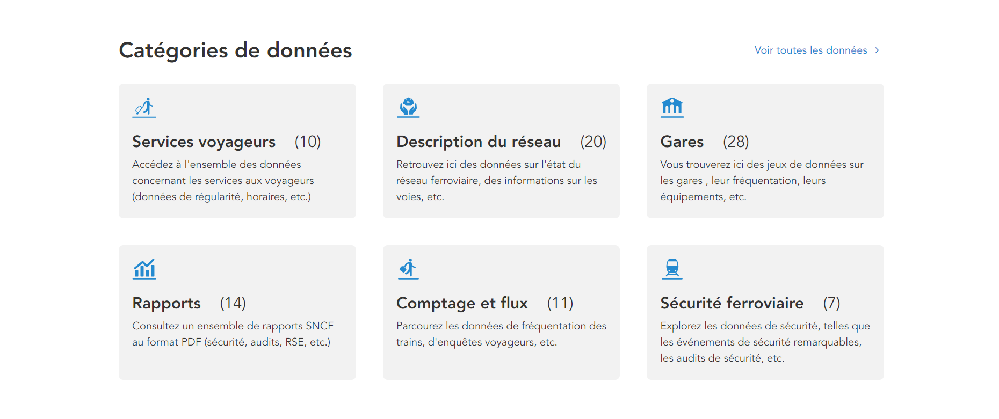

# Introduction

Ce projet a été réalisé dans le cadre du cours **Visualisation de données**, au cours du semestre de **printemps 2024**, à **l'Université de Technologie de Troyes**.

Pour cette étude, nous avons choisi d'analyser des données originales qui nous permettent de nous interroger sur **l'étude du transport ferroviaire en France**. Notre analyse portera sur des jeux de données extraits du site de données de la SNCF (Société Nationale des Chemins de fer Français) [Data SNCF](https://data.sncf.com). L'ensemble des données qui vont donc être traitées dans ce projet proviennent donc toutes de cette source. Nous n'avons donc pas utilisé de jeux de données extérieurs à ce site.

Les données récoltées sur le transport sont assez importantes c'est pourquoi nous avons choisi de nous concentrer sur une découverte avec un spectre assez large, allant des voyageurs aux objets perdus. Nous utiliserons les données des gares, des voyageurs et des objets perdus/retrouvés. Cette étude permettra de déterminer et de comprendre des tendances clés associées au trafic ferroviaire sur des périodes allant de 2017 à 2022.

L'objectif de ce projet est de fournir des interprétations basées sur les visualisations issues d'une analyse exploratoire de nos jeux de données (7 jeux de données). 

## Données

Nous avons donc choisi d'étudier sept jeux de données (7) issues du site [Data SNCF](https://data.sncf.com). Ce sont des données collectées par la SNCF parmi les différentes catégories disponible sur le site (voir ci-dessous).



Ces données concernent des objets possedés par la SNCF (gares, objets) mais aussi des enquêtes réalisées sur des individus anonymement (fréquentation, voyageurs). Les données sont liées à une période temporelle précise de **2017 à 2022**.

> L'ensemble des données brutes sont accessibles depuis le dossier /data.

**Nombre d'observations**

Le nombre d'observations varie selon chaque jeu de données. Pour plus de détail, nous avons détaillé précisement le nombre d'observations dont nous disposions.

| --- | Nom du dataset                                                                                | Nombre d'observations | Lien                                                                                                     | Description                                  |
| --- | --------------------------------------------------------------------------------------------- | --------------------- |-------------------------------------------------------------------------------------------------------- | ----------------------------------------------- |
| 01  | dataset1-gares-de-voyageurs.csv                                                               | 2.862                 | [Dataset1](https://data.sncf.com/explore/dataset/gares-de-voyageurs/export/)                                                                      | Jeu de données sur les gares de voyageurs       |
| 02  | dataset2-frequentation-gares.csv                                                              | 21.147                | [Dataset2](https://data.sncf.com/explore/dataset/frequentation-gares/export/)                                                                     | Jeu de données sur la fréquentation des gares   |
| 03  | dataset3-motif-deplacement.csv                                                                | 284                   | [Dataset3](https://data.sncf.com/explore/dataset/motif-deplacement/export/)                                                                       | Jeu de données sur les motifs de déplacement    |
| 04  | dataset4-enquetes-gares-connexions-repartition-par-repartition-par-categories-socio-profe.csv | 697                   | [Dataset4](https://data.sncf.com/explore/dataset/enquetes-gares-connexions-repartition-par-repartition-par-categories-socio-profe/export/)        | Jeu de données sur les CSP des voyageurs        |
| 05  | dataset5-enquetes-gares-connexions-repartition-repartition-par-classe-dage.csv                | 375                   | [Dataset5](https://data.sncf.com/explore/dataset/enquetes-gares-connexions-repartition-repartition-par-classe-dage/export/)                       | Jeu de données sur l'âge des voyageurs          |
| 06  | dataset6-objets-trouves-gares.csv                                                             | 1.844.912             | [Dataset6](https://data.sncf.com/explore/dataset/objets-trouves-gares/export/)                                                                    | Jeu de données sur les objets trouvés en gare   |
| 07  | dataset7-objets-trouves-restitution.csv                                                       | 858.180               | [Dataset7](https://data.sncf.com/explore/dataset/objets-trouves-restitution/export/)                                                              | Jeu de données sur les objets restitués         |


Au sein de ces données nous constatons que toutes s'orchestrent autour d'une donnée principale (Gare, 01) qui est présent dans tous les datasets. Nous pouvons donc segmenter les données restantes par des critères géographiques (02,03,04,05), des critères temporels (06,07), des critères voyageurs (08,09,10,11,12,13,14) et des critères sur les objets perdus/trouvés (15,16,17).

**Variables**

Nous avons décidé d'utiliser **17 variables** pour notre projet provenant des jeux de données bruts ou alors d'attributs crées par nos soins.

| --- | Nom de la variable      | Type     | Format              | Dataset (Origine) | Description                                                    |
| --- | ----------------------- | -------- | ------------------- | ----------------- | -------------------------------------------------------------- |
| 01  | gare                    | Nominale | String              | 1,2,3,4,5,6,7     | Nom de la gare                                                 |
| 02  | departement             | Ordinale | NN                  | 1                 | Numéro du département                                          |
| 03  | zone                    | Nominale | {A,B,C}             | 1                 | Lettre correspondant à la zone géographique                    |
| 04  | latitude                | Continue | M"S'NS              | 1                 | Latitude de l'objet gare                                       |
| 05  | longitude               | Continue | M"S'NS              | 1                 | Longitude de l'objet gare                                      |
| 06  | annee                   | Ordinale | YYYY                | 2,3,4             | Année correspondante                                           |
| 07  | timing_reception        | Discrète | YYYY-MM-DD-HH-MM-SS | 6,7               | Réception de l'objet perdu                                     |
| 08  | nb_voyageurs            | Discrète | Integer             | 2                 | Nombre de voyageurs                                            |
| 09  | age                     | Ordinale | String              | 5                 | Age d'un voyageur                                              |
| 10  | pourcentage_age         | Continue | %                   | 5                 | Pourcentage sur l'âge des voyageurs                            |
| 11  | csp                     | Nominale | String              | 4                 | Catégorie socio-professionnel d'un voyageur                    |
| 12  | pourcentage_csp         | Continue | %                   | 4                 | Pourcentage sur la catégorie socio-professionnel des voyageurs |
| 13  | motif_deplacement       | Nominale | String              | 3                 | Motif de déplacement d'un voyageur                             |
| 14  | pourcentage_deplacement | Continue | %                   | 3                 | Pourcentage sur le motif de déplacement des voyageurs          |
| 15  | nature_objet            | Nominale | String              | 6,7               | Nature de l'objet                                              |
| 16  | categorie_objet         | Nominale | String              | 6,7               | Catégorie de l'objet                                           |
| 17  | code_uic                | Nominale | NNNNNNNNNN          | 6,7               | Code UIC de la gare                                            |

**Variables particulières**

Notre jeu de données comprenant des coordonnées spatiales, nous avons estimé qu'il était intéressant de réaliser des cartes. En effet, les coordonnées géographiques de longitude et latitude pourront être utilisée pour catographier le réseau des gares françaises.

L'ensemble des données énoncées plus en haut nous paraissent pertinentes dans le cadre d'une étude. En effet, elles permettent :

- d'étudier les effets de la fréquentation sur les vols/pertes d'objets
- d'effectuer une analyse temporelle et spatiale du réseau
- d'effectuer des classements et des comparaisons entre les différentes régions et/ou départements (analyse multiscalaire). Exemple : espace moins déservi par exemple.


## Plan d'analyse

1. **Découverte du jeu de données** et surtout comprendre à quoi servent nos données. Par exemple : nous souhaitons réaliser des visualisations sur le réseau ferroviaire actuel, étudier la répartition générale des voyageurs...
    > A quoi ressemble le réseau SNCF en France ? Quels sont les départements les mieux équipés ? A quel point Paris a une place importante dans le réseau des autres territoires ?

2. **Analyse des voyageurs** : De façon plus précise, nous étudierons les voyageurs qui utilisent quotidiennement les réseaux ferrés français. Cela passera notamment par des attributs d'âge, de CSP ou encore de motif de déplacement.
    > Le nombre de voyageurs est-il bien repartis entre les gares d'un même département ? Quel est le voyageur moyen de la SNCF ? Comment ce voyageur diffère en fonction des gares ? Quel est la relation entre les motifs de voyage des passagers et leur répartition par âge et par profession ?

3. **Analyse des objets** : De la même façon, nous souhaiterions étudier les objets perdus en gares. Pour cela, nous utiliserons également un second jeu de données sur les objets retrouvés.
    > Y-a-t-il plus de chances de perdre un objet selon la gare ? Doit-on s'attendre à un afflux d'objets perdus plus important dans les mois de Juillet-Août 2024 plus important que les dernières années ? Quelles sont les chances de retrouver un objet perdu ? Quelles sont les chances de retrouver un objet en fonction de sa nature ?

4. **Analyse spatiale** : A l'aide de nos données spatiales, nous souhaitons réaliser des cartes. Ces dernières permettront visuellement de voir la disposition et la répartition des gares en France Métropolitaine.
5. Enfin si nous souhaitons **rajouter des questions**, nous nous laissons la liberté de les rajouter au plan d'analyse.


```{r setup}
library(ggplot2)
library(dplyr)
library(tidyr)
library(tibble)
library(readr)
library(lubridate)
library(forcats)
library(stringr)
library(sf)
library(rnaturalearth)
library(rnaturalearthdata)
```


# Nettoyage des données

Le **nettoyage des données** est la première étapes de notre projet. C'est ici que nous allons créer de nouvelles tables, modifier les jeux de données existants (supprimer ou renommer les colonnes existantes).
*[TODO] Ajouter des explications sur la complexité de nos données*

Afin de travailler proprement, nous avons réaliser les étapes suivantes : 

1. Nous avons commencé par **observer les colonnes** de nos jeux de données. Nous avons pu isoler lesquels étaient susceptibles d'être utilisées. Nous les avons ensuite **importées**.

2. Ensuite, nous avons choisi de **renommer les colonnes** de nos jeux de données selon une norme précise (voir **Convention de nommage des colonnes** ci-dessous). Les colonnes de base des tables utilisaient des espaces, ce qui est incompatible avec l'appel de ces dernières.

3. Une fois les tables modifiées, nous avons du **filtrer nos données**.


**Convention de nommage des colonnes**
- Transformer les espaces en underscore.
- Nommer les variables avec des minuscules. 

> Exemple : Code Postal en code_postal


*[TODO] Rajouter des données les tables modifiées ici*


## Importation des jeux de données

```{r}
gares <- read_delim(file = "data/dataset1-gares-de-voyageurs.csv", delim=";")
frequentation <- read_delim(file = "data/dataset2-frequentation-gares.csv", delim=";")
motif_depl <- read_delim(file = "data/dataset3-motif-deplacement.csv", delim=";")
CSP_voya <- read_delim(file = "data/dataset4-enquetes-gares-connexions-repartition-par-repartition-par-categories-socio-profe.csv", delim=";")
age_voya <- read_delim(file = "data/dataset5-enquetes-gares-connexions-repartition-repartition-par-classe-dage.csv", delim=";")
obj_perdus <- read_delim(file = "data/dataset6-objets-trouves-gares.csv", delim=";")
obj_trouves <- read_delim(file = "data/dataset7-objets-trouves-restitution.csv", delim=";")
```
```{r}
#Nettoyage des données pour le traitement
gares_clean <- gares %>%
  separate("Position géographique", into = c("Latitude", "Longitude"), sep = ", ") %>%
  mutate(across(c(Latitude, Longitude), as.numeric)) %>%
  rename(Gare = "Nom", Code_Postal = "Code commune", Zones_vac = "Segment DRG")

frequentation_clean <- frequentation %>%
  rename_with(.cols = contains("Non"), 
              ~ sub('Total Voyageurs \\+ Non voyageurs', "Personnes", .))%>%
  rename_with(.cols = contains("Total"), 
              ~ sub('Total Voyageurs', "Voyageurs", .))%>%
  pivot_longer(cols = starts_with("Personnes") | starts_with("Voyageurs"), 
               names_to = c(".value", "Année"), 
               names_sep = " ")%>%
  mutate(Année = as.numeric(Année))%>%
  rename(Gare = "Nom de la gare", UIC = "Code UIC", Code_Postal = "Code postal", Zones_vac = "Segmentation DRG")%>%
  mutate(UIC = as.character(UIC)) %>%
  mutate(UIC = substr(UIC, 3, 8)) %>%
  mutate(Département = substr(Code_Postal, 1, 2))
  
View(frequentation_clean)

age_voya_clean <- age_voya %>%
  rename(Gare = `Gare enquêtée`)%>%
  mutate(UIC = as.character(UIC))
  

gares_freq_clean <- gares_clean %>% 
  inner_join(frequentation_clean, by = "Gare")
#Création du template de la France
france <- ne_countries(scale="medium", country = "France", returnclass="sf")%>%
  st_crop(xmin = -5.2, xmax = 9.7, ymin = 41, ymax = 51)  # Limites de la France métropolitaine
```

---
# Découverte


Dans cette partie, nous découvrirons le jeu de données. 

**Visualisations réalisées**

1. Fréquentation des gares

2. Carte de la fréquentation des gares en France Métropolitaine

[TODO] à compléter

> L'ensemble des visualisations sont réalisées avec les données de l'année **2022**, car ce sont les données les plus récentes à notre disposition.


*À quoi ressemble le réseau SNCF en France ? Quels sont les départements les mieux équipés ? À quel point Paris a une place importante dans le réseau des autres territoires ?*

## 1. Fréquentation des gares

Tout d'abord, voici un petit tour d'horizon du dataset **Frequentation**.

```{r}
head(frequentation_clean)
summary(frequentation_clean)
```

Nous avons choisi d'utiliser des données discrètes (nombre de voyageurs) en abscisse et nominales (gares) en ordonnée. Afin de constater les différences entre les gares, une comparaison basée sur un bar chart a été réalisée ci-dessous.

De plus, afin d'obtenir un classement des gares les plus fréquentées, nous avons choisi de filtrer le dataset pour ne garder que les gares au dessus d'un seuil de 20.000.000 individus. Ce filtre nous permet de faire ressortir les gares les plus fréquentées uniquement.


```{r}
freq <- frequentation_clean %>%
  select(Gare, Voyageurs, Année) %>%
  filter(Voyageurs > 20000000) %>%
  filter(Année == "2022")

ggplot(data = freq, mapping = aes(x=Voyageurs,y=Gare)) +
  geom_col() +
  theme_minimal() +
  labs(title = "Fréquentation par gare (2022)",
       subtitle = "< minimum 20.000.000 de voyageurs >",
       x = "Nombre de voyageurs",
       y = "Gares")
```

**Analyse :**

On remarque que les gares avec le plus de fréquentation sont les gares parisiennes. En termes de positionnement, nous retrouvons : Gare du Nord (1), Gare Saint-Lazare (2), Gare de Lyon (3), Gare Montparnasse (4). D'autres gares se démarquent mais restent sensiblement proches les unes des autres.

Cette visualisation n'est pas étonnante si l'on utilise régulièrement le réseau RATP et SNCF en Ile de France. En effet, la grande majorité des trajets partent de Paris et arrivent sur Paris. 

Gare du Nord semble être la gare la plus fréquentée du réseau. En faisant des recherches, on apprend qu'elle permet des départs vers le Royaume-Uni (Londres-St-Pancras), la Belgique (Bruxelles-Midi) ou encore les Pays-Bas (Amsterdam-Centraal) *(Figure 1)*. La population est généralement importante dans ces grandes villes et capitales européennes, ce qui explique également la fréquentation de Gare du Nord que ce soit pour des trajets professionnels ou touristiques.

")
Figure 1. Carte des destinations en France et en Europe (2022)

Source : https://www.sncf-connect.com/aide/le-reseau-sncf-en-france-et-en-europe


## 2. Carte de la fréquentation des gares en France Métropolitaine

[TODO] est ce qu'on laisse la couleur ? pertinent de décrire par année en couleur alors qu'on dit que c'est en 2022

Pour poursuivre notre découverte du réseau SNCF, nous avons choisi de représenter la fréquentation des gares sur une carte de France Métropolitaine. Avec cette visualisation cartographique, on peut comprendre plus spatialement les enjeux liés aux flux de voyageurs en 2022. 

Pour représenter cela, on utilise des données discrètes (longitude, latitude, nombre de voyageurs) et ordinales (année) sur une carte. Etant donné qu'il s'agit d'une carte, on place la longitude en abscisse et la latitude en ordonnée. De plus, on a ajouté de la couleur afin de faire ressortir des gares qui n'ont plus vraiment de fréquentation en 2022. 


```{r}
ggplot(data = france) +
  geom_sf(fill = "white", color = "black") +
  geom_point(data = gares_freq_clean, aes(x = Longitude, y = Latitude, size=Voyageurs, color = Année), alpha = 0.7) +
  scale_size_continuous(
    range = c(1,8), 
  ) +
  theme_minimal() +
  labs(title = "Fréquentation par gare (2022)",
       x = "Longitude",
       y = "Latitude",
       size = "Fréquentation")
```

**Analyse :**

Au premier abord, on remarque que les gares tracent d'elles même, sur la carte, la majeur partie du réseau ferroviaire français *(Figure 2)*. Cette visualisation est donc toujours assez proche de la réalité en 2022.

On remarque que la fréquentation des gares s'articule autour de quatre principaux espaces : l'espace parisien (Paris), l'espace Nord (Lille), l'espace Est (Strasbourg), l'espace lyonnais (Lyon). Comme nous le pensions, la fréquentation des gares est plus importante autour des grandes villes. Avec cette profondeur supplémentaire, cela nous permet de formuler de nouvelles conjectures : la population en périphérie des grandes villes fréquente généralement les gares du réseau pour des motifs professionnels (population active).

Cette visualisation complète notre première analyse : Paris est le centre du réseau ferroviaire français, *"tout passe par Paris"*. Cette règle s'applique également avec le réseau autoroutier français.

")
Figure 2. Carte du réseau SNCF en France (2020)

Source : https://www.sncf-connect.com/aide/le-reseau-sncf-en-france-et-en-europe


---
# Voyageurs

Dans cette partie, nous étudierons les voyageurs. Afin de mieux comprendre les voyageurs, nous avons choisi de nous intéresser aux différents profils qui utilisent les trains des réseaux ferrés de France.

**Visualisations réalisées**

1. Nombre de voyageurs total par département (2022)

2. Répartition du nombre de voyageurs dans les gares d'un même département.Exemple département (77)

3. Explorer la répartition par âge des passagers

4. Catégorie socio professionnelle

5. Nombre de voyageurs par année


Dans un premier temps, nous analysons le nombre de voyageurs par département, pour nous intéresser ensuite à la proportion de voyageurs dans les gares au sein d'un même département.


*Le nombre de voyageurs est-il bien repartis entre les gares d'un même département ?*

## 1. Nombre de voyageurs total par département (2022)

```{r}
freq_departement <- frequentation_clean %>%
  filter(Année == "2022")

freq_departement <- freq_departement %>%
  group_by(Département) %>%
  summarize(Total_passagers = sum(Voyageurs))

ggplot(freq_departement, aes(x = Total_passagers, y = Département)) +
  geom_bar(stat = "identity") +
  labs(title = "Nombre de voyageurs total par département (2022)",
       subtitle = "<Vue Globale>",
       x = "Nombre total de passagers",
       y = "Département") +
  theme(axis.text.y = element_text(size = 8))

```

Comme le constat fait un peu plus haut, on observe que la région Ile de France (composée des départements 75,77, 78, 91, 92, 93, 94) concentre la plupart de la fréquentation. Ce constat est tout à fait correct étant donné que la région concentre environ 12 millions de personnes.

On peut également créer une visualisation qui permettrait de connaitre la fréquentation de chacune des régions.

```{r}

View(frequentation_clean)

```


## 2. Répartition du nombre de voyageurs dans les gares d'un même département.Exemple département (77)

Grâce à cette visusalisation, on peut connaître les gares les plus importantes en termes de fréquentation dans chacun des départements.

Dans le cas du département 77 et du premier jet de visualisation, on observe que la gare de Melun est très fréquentée comparé aux autres gares.

```{r}
gares_77 <- freq %>%
  filter(departement == "77")

ggplot(gares_77, aes(x = Gare, y = Voyageurs)) +
  geom_bar(stat = "identity") +
  labs(title = "Repartition des voyageurs dans les gares du département 77 en 2022",
       x = "Gare",
       y = "Nombre de passagers") +
  theme_minimal() +
  theme(axis.text.x = element_text(angle = 45, hjust = 1, size = 8))


```

Au sein du 77, on remarque des disparités entre les gares. Des gares comme celle de Melun ou Chartrette concentre toute la fréquentation au détriment de gares comme Bois-le-Roi.

On peut expliquer cela notamment après quelques recherches car en effet le RER D désert Melun à la différence de petites gares comme celle de Bois-le-Roi.


**Quel est le voyageur moyen de la SNCF ?**

## 3. Explorer la répartition par âge des passagers

En raison de quelques problèmes dans l'ensemble de données, tels que des codes UIC incohérents et des variations dans les années de recensement et les données des stations, nous allons nous concentrer exclusivement sur la répartition par âge pour les années 2015, 2016 et 2017.

Conserver les colonnes spécifiées dans frequentation et renommer Code UIC en UIC et Filtrer le age_voya pour une année 2015,16,17.

```{r}
age_filtered <- age_voya_clean %>%
  filter(Année %in% c(2015, 2016, 2017))
```

Filtrer freq_selected par nom de station, en ne conservant que les lignes qui correspondent à Nom dans age_filtered, et vice versa.

```{r}
freq_matched <- semi_join(freq_selected, age_filtered, by = "Gare")
age_matched <- semi_join(age_filtered, freq_selected, by = "Gare")
joined_dataset <- inner_join(age_filtered, frequentation_clean, join_by(UIC, Année))
clean_dataset<- joined_dataset %>%
  pivot_wider(
    names_from = `Classe d'âge`, 
    values_from = Pourcentage, 
    values_fill = list(Pourcentage = 0)  
  )
```

Diviser les données dans freq_matched par année.

```{r}
freq_long <- freq_matched %>%
  pivot_longer(
    cols = c(`Total Voyageurs 2015`, `Total Voyageurs 2016`, `Total Voyageurs 2017`),
    names_to = "Année",
    values_to = "Total Voyageur",
    names_prefix = "Total Voyageurs "
  ) %>%
  mutate(Année = as.integer(Année))
```

Combinaison de données dans age_filtered par année.

```{r}
age_wide <- age_matched %>%
  pivot_wider(
    names_from = `Classe d'âge`, 
    values_from = Pourcentage, 
    values_fill = list(Pourcentage = 0)  
  )
```

Fusionner et supprimer les lignes contenant des données nulles.

```{r}
combined_dataset <- left_join(freq_long, age_wide, by = c("Nom", "Année"))
cleaned_dataset <- na.omit(combined_dataset)
```

Calculer le nombre de voyageurs dans chaque groupe d'âge et les nombre total pour chaque année

```{r}
age_columns <- c('19 ans et moins', '20 ans à 29 ans', '30 ans à 39 ans', '40 ans à 49 ans', '50 ans à 59 ans', '60 ans et plus')
cleaned_dataset <- cleaned_dataset %>%
  mutate(across(all_of(age_columns), ~ .x * `Total Voyageur` / 100, .names = "passengers_{.col}"))
age_passenger_totals <- cleaned_dataset %>%
  group_by(Année) %>%
  summarise(across(starts_with("passengers"), sum, .names = "total_{.col}"))
```

L'étape suivante consiste à calculer le pourcentage des groupes d'âge ainsi que la cartographie.

```{r}
age_passenger_totals_long <- age_passenger_totals %>%
  pivot_longer(
    cols = starts_with("total_passengers"),
    names_to = "Age_Group",
    values_to = "Total_Passengers",
    names_prefix = "total_passengers_"
  )
age_passenger_totals_long <- age_passenger_totals_long %>%
  group_by(Année) %>%
  mutate(Total_Passengers_Year = sum(Total_Passengers)) %>%
  ungroup() %>%
  mutate(Percentage = (Total_Passengers / Total_Passengers_Year) * 100)
ggplot(age_passenger_totals_long, aes(x = Année, y = Percentage, fill = Age_Group)) +
  geom_bar(stat = "identity", position = "dodge") +
  labs(title = "Percentage of Passengers by Age Group and Year",
       x = "Year",
       y = "Percentage (%)",
       fill = "Age Group") +
  theme_minimal()
```

 
## 4. Catégorie socio professionnelle

Il est également intéressant de recueillir des informations sur le voyageur moyen de la SNCF, En premier lieu nous allons voir les différentes catégories socio professionnelles.

PS : Le Pourcentage correspond au pourcentage par rapport au CSP d'UNE gare.

```{r}
profil_moyen <- CSP_voya %>%
  group_by(CSP) %>%
  summarise(Pourcentage_moyen = mean(Pourcentage, na.rm = TRUE))

profil_moyen <- profil_moyen %>%
  arrange(desc(Pourcentage_moyen))
profil_moyen

```

Regroupement des CSP par pourcentages.

```{r}
ggplot(profil_moyen, aes(x = reorder(CSP, -Pourcentage_moyen), y = Pourcentage_moyen)) +
  geom_bar(stat = "identity") +
  coord_flip() + 
  labs(title = "Profil Moyen du Voyageur SNCF par CSP",
       x = "Catégorie Socio-Professionnelle",
       y = "Pourcentage Moyen") +
  theme_minimal()
```

## 5. Nombre de voyageurs par année

Réalisons un graphique simple qui nous montre le nombre de voyageurs total par année.

Apercu du dataset fréquentations 

```{r}
head(frequentation)
```


```{r}

total_par_annee <- frequentation %>%
  summarise(
    Total_2022 = sum(`passagers2022`, na.rm = TRUE),
    Total_2021 = sum(`Total Voyageurs 2021`, na.rm = TRUE),
    Total_2020 = sum(`Total Voyageurs 2020`, na.rm = TRUE),
    Total_2019 = sum(`Total Voyageurs 2019`, na.rm = TRUE),
    Total_2018 = sum(`Total Voyageurs 2018`, na.rm = TRUE),
    Total_2017 = sum(`Total Voyageurs 2017`, na.rm = TRUE),
    Total_2016 = sum(`Total Voyageurs 2016`, na.rm = TRUE),
    Total_2015 = sum(`Total Voyageurs 2015`, na.rm = TRUE)
  )

data_long <- pivot_longer(total_par_annee, cols = everything(), names_to = "Annee", values_to = "Total")

ggplot(data_long, aes(x = Annee, y = Total, group = 1)) +
  geom_line() +  
  geom_point() +  
  labs(title = "Nombre total de voyageurs par année",
       x = "Année",
       y = "Nombre total de voyageurs") +
  theme_minimal()
```
On voit rapidement qu'il y a un "trou" du à la période COVID 2020.

Maintenant intéressons nous aux nombres de voyageurs par segmentation DRG.

```{r}
library(ggplot2)


data_segmentation <- frequentation %>%
  group_by(`Segmentation DRG`) %>%
  summarise(Total_2022 = sum(`passagers2022`, na.rm = TRUE)) %>%
  na.omit()
head(data_segmentation)

ggplot(data_segmentation, aes(x = `Segmentation DRG`, y = Total_2022, fill = `Segmentation DRG`)) +
  geom_bar(stat = "identity") +
  labs(title = "Répartition des voyageurs par segmentation DRG en 2022",
       x = "Segmentation DRG",
       y = "Nombre total de voyageurs") +
  theme_minimal()
```


---
# Objets

Dans cette partie, nous voulons nous intéresser plus particulièrement aux objets.


**Visualisations réalisées**

1. Objets perdus

2. Objets restitués

3. Probabilité de retrouver un objet perdu

4. Probabilité de retrouver un objet selon son type


## 1. Objets perdus

Tout d'abord, petite visualisation du dataset obj_perdus

```{r}
head(obj_perdus)
summary(obj_perdus)
```

Quelque chose m'interpelle dès le début : c'est la colonne "Type d'enregistrement", il semble que celle-ci est toujours remplie de la même manière

```{r}
enregistrement <- obj_perdus %>%
  select(en = `Type d'enregistrement`)
diff_enre <- n_distinct(enregistrement)
```

C'est donc le cas, donc nous n'utiliserons pas cette colonne .

On distingue aussi que de nombreuses gares ne sont pas présentes.

Nous voulons effectuer plusieurs réductions sur ce jeu de données. Tout d'abord, les informations que nous avons datent de 2019 jusqu'à nos jours. Si nous voulons faire des recoupements avec le dataset de voyageur, nous allons restreindre les dates à 2019 seulement car les années 2020 et 2021 ne sont pas forcément représentatives du traffic ferroviaire normal. L'année 2022 sera analysée prochainement pour voir si une tendance peut commencer à apparaître.

```{r}
obj_perdus_2019 <- obj_perdus %>%
  select(date = `Date de la déclaration de perte`, gare = "Gare", UIC = "Code UIC", nature = "Nature d'objets", type = "Type d'objets") %>%
  filter(date < ymd(20200101)) %>% 
  filter(date > ymd(20190101))
count(obj_perdus_2019)
```

Nous avons donc maintenant 185 065 entrées dans notre dataframe.

Découvrons ce que celui-ci nous cache dans la répartition des objets perdus :

```{r}
obj_perdus_2019 %>% 
  ggplot(aes(y=fct_rev(fct_infreq(type)))) +
  geom_bar() +
  labs(title = "Nombre d'objets perdus par type d'objets en 2019",
       y = "Type d'objet",
       x = "Nombre d'objets perdus en unité")+
  theme_minimal() +
  theme(axis.text.y = element_text(size = rel(0.8)))
```

Sans surprise, les objets les plus couramment perdus sont donc dans l'ordre :

-   Bagages

-   Appareils électroniques

-   Vêtements

```{r}
obj_perdus_trouves <- obj_perdus_2019 %>%
  filter(is.na(gare) == FALSE)

count(obj_perdus_trouves)
```

```{r}
obj_perdus_trouves %>% 
  ggplot(aes(y=fct_rev(fct_infreq(type)))) +
  geom_bar() +
  labs(title = "Nombre d'objets perdus retrouvés par type d'objets en 2019",
       y = "Type d'objet",
       x = "Nombre d'objets perdus en unité") +
  theme_minimal() +
  theme(axis.text.y = element_text(size = rel(0.8)))
```

## 2. Objets restitués

Nous allons ensuite parcourir le dataset 7 : obj_trouves

```{r}
obj_trouves_2019 <- obj_trouves %>%
  select(date = `Date`,restitution = `Date et heure de restitution` ,gare = "Gare", UIC = "Code UIC", nature = "Nature d'objets", type = "Type d'objets") %>%
  filter(date < ymd(20200101)) %>% 
  filter(date > ymd(20190101))
count(obj_trouves_2019)
```

On découvre donc qu'il y a plus d'objets trouvés que d'objets perdus rendus. Cela veut donc dire que tous les objets récupérés ne sont pas forcément déclarés comme perdus au préalable.

```{r}
obj_trouves_rendus <- obj_trouves_2019 %>%
  filter(is.na(UIC) == FALSE)

count(obj_trouves_rendus)

```

On voit qu'il y a 19 objets rendus qui n'ont pas été identifiés par des code UIC ce qui est étrange. Voyons cela de plus près :

```{r}
obj_trouves_sans_UIC <- obj_trouves_2019 %>%
  filter(is.na(UIC) == TRUE)

obj_trouves_sans_UIC
```

En voyant que la gare n'est pas présente non plus, on peut juger ce rendu comme ayant été entré dans la database sans qu'il n'ait été rendu dans une gare. On peut supposer un rendu dans le train juste après la perte.

Nous allons maintenant essayer de comprendre ce qu'est ce code UIC et s'il y a une relation entre les codes UIC des pertes et des objets trouvés.

Nous allons donc comparer les 2 listes de code UIC

```{r}
liste_UIC_perdus <- obj_perdus_trouves %>%
  select(UIC)
liste_UIC_trouves <- obj_trouves_rendus %>%
  select(UIC)
count(intersect(liste_UIC_perdus, liste_UIC_trouves))
count(setdiff(liste_UIC_perdus,liste_UIC_trouves))
```

Il semble que seulement 146 code UIC différents et après quelques recherches en ligne, le code UIC est l'ID des gares. Donc cette colonne ne nous est pas forcément utile.

Nous allons donc maintenant essayer de mettre en relation plutôt les dates entre les 2 datasets :

```{r}
liste_date_perdus <- obj_perdus_trouves %>%
  select(date)
liste_date_trouves <- obj_trouves_rendus %>%
  select(date)
intersect(liste_date_perdus, liste_date_trouves)
setdiff(liste_date_perdus,liste_date_trouves)
```

Nous avons donc seulement 302 dates en commun entre les 2 jeux de données ce qui est très faible. On peut donc supposer que les 2 datasets ne sont pas liés et les dates ne correspondent pas. On peut supposer que la date des objets perdus provient du questionnaire de perte que les voyageurs remplissent, tandis que la date des objets trouvés provient du formulaire remplit par les agents SNCF.

Nous ne pouvons donc pas faire de relation directe entre un objet déclaré comme perdu et un objet déclaré comme trouvé.

Il est donc difficile de faire des hypothèses très spécifique sur les probabilités de retrouver un objet perdu. La façon de faire ça serait de connaître un nombre précis de pertes et sur ces pertes savoir combien d'entre elles ont été rendues. Sans le lien entre les pertes et les objets rendus, énormément de biais peuvent apparaître. Pour faire les prochaines probabilités, nous allons faire l'hypothèse que l'ensemble des objets rendus ont fait l'objet d'une entrée dans le formulaire de perte.


**Quelles sont les chances de retrouver un objet perdu ?**

## 3. Probabilité de retrouver un objet perdu

Pour cette première probabilité nous allons faire un calcul simple :

(Nombre d'objets retrouvés / Nombre d'objets perdus) \*100

Cela s'exprime ainsi :

```{r}
proba_commune <- (count(obj_trouves_2019) / count(obj_perdus_2019) * 100)
proba_commune
```

Je trouve la probabilité relativement élevée car pas très éloignée du 50%. Peut-être aussi que le postulat personnel avant le calcul était relativement pessimiste.


**Quelles sont les chances de retrouver un objet en fonction de son type ?**

## 4. Probabilité de retrouver un objet selon son type

Afin d'avoir une probabilité selon le type il faut donc que nous effectuons la même opération que précédemment avec comme paramètre le type de l'objet.

N.B. la "nature" dans l'intitulé de la question a été changé en type car la nature entrée dans le formulaire des objets trouvés est trop spécifique.

```{r}
type_obj_perdus <- obj_perdus_2019 %>%
  select(type)
type_obj_trouves <- obj_trouves_2019 %>%
  select(type)
occurences_perdus <- table(type_obj_perdus)
occurences_trouves <- table(type_obj_trouves)
probas_types <- occurences_trouves / occurences_perdus * 100
probas_types <- as.data.frame.table(probas_types)
colnames(probas_types)
probas_types %>% 
  mutate(type_obj1 = fct_reorder(type_obj_trouves,Freq)) %>%
  ggplot(aes(x=type_obj1, y=Freq)) +
  geom_col() + 
  ylim(0,100) +
  labs(title = "Fréquence de rendu d'objets perdus par type",
       y = "Fréquence de retour",
       x = "Type d'objet",) +
  theme_minimal() +
  theme(
    plot.title = element_text(size = rel(2)),
    axis.text.x = element_text(
      size = rel(0.65),
      face = "italic",
      angle = 45,
      vjust = 1,
      hjust = 1
    )
  )
```
Plus de 50 points distinguent la fréquence de retour des vélos, trotinettes et accessoires de celle des livres et articles de papèterie. Les célos, trottinettes et accessoires est une catégorie qui est bien au-dessus du second article le plus rendu de + de 10 points.
Je m'attendais clairement à un taux de retour bien moins important sur toutes les catégories car mon environnement proche parlait souvent d'objets perdus et peu d'objets retrouvés. J'ai l'impression que l'encombrement et la nécessité d'un objet influence sur taux de retour. Un vélo, article de sport, parapluie, sont souvent encombrants et facile à identifier. Les porte-monnaies, pièces d'identité sont aussi proche du 50% ce qui me semble normal.

Il serait aussi intéressant de voir que ces statistiques sont fondées sur les objets qui sont perdus en train ou en gare et ceux qui sont ramenés en gare par d'autres voyageurs ou agents. Les vols ne sont donc pas forcément comptabiliser. Je pense qu'avec plus d'informations, nous pourrions ajouter un critère de vol ou perte selon l'objet. Malheureusement les données ne sont pas assez détaillées, mais nous pourrions peut-être deviner une tendance en croisant d'autres études portant sur le sujet.

---
# Conclusion


## Notre avis sur le projet


---
Copyright : [Mathis Girod](https://github.com/girodmat), [Maxence Jaulin](https://github.com/maxencejaulin), [Louis Prodhon](https://github.com/Grexiem), [Wang Zezhong](https://github.com/RubiesWzz)

